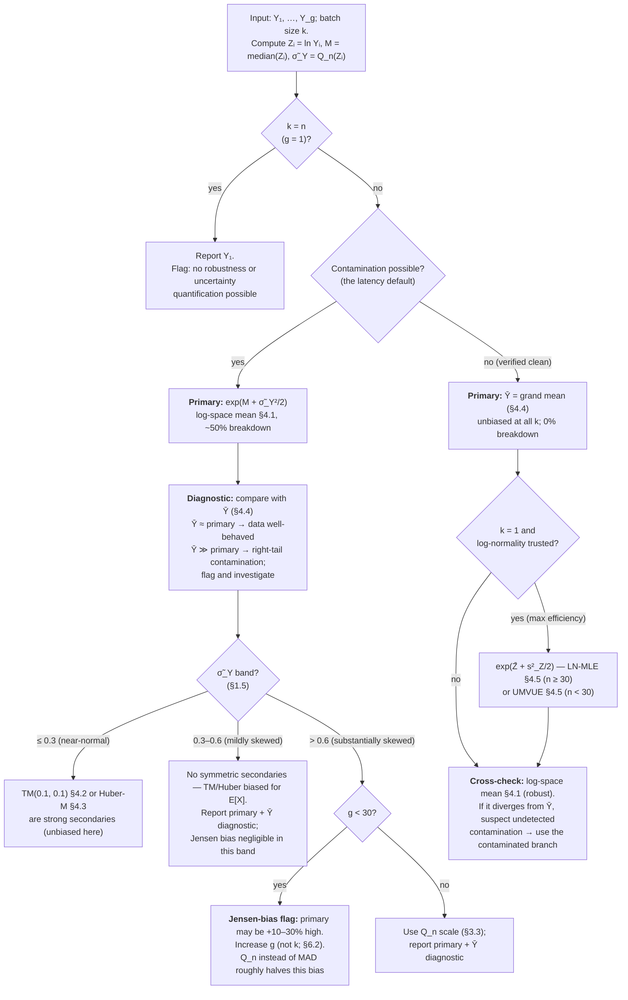
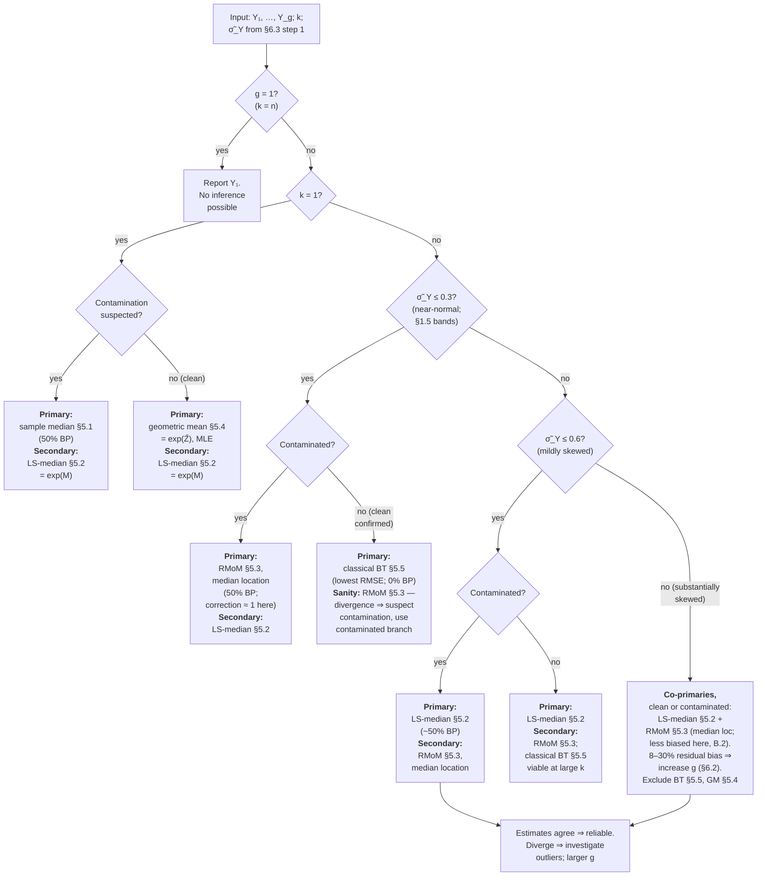

# Optimum Estimators of the Mean and Median of a Lognormal Distribution from Batched Group Means

> **Context.** In latency benchmarking the raw per-call execution time of a fast function cannot
> be measured reliably because measurement infrastructure (timer calls, loop control) consumes a
> non-trivial fraction of the wall-clock time. A common remedy is *batching*: call the target
> function $k$ times per timed block and record the block time divided by $k$. The result is a
> *group mean* $Y_j$ of $k$ IID latency observations. This report addresses the statistical problem
> of estimating the mean and median of the underlying latency distribution from those group means.
>
> **$k$ is a technical constraint, not a free statistical design choice.** Let $O$ be the fixed
> timing overhead per block and $\varepsilon$ the fractional-overhead tolerance (typically 1–5%).
> The minimum feasible batch size is
> $$k \geq k_{\min} = \left\lceil \frac{O}{\varepsilon\,\mathrm{E}[X]} \right\rceil.$$
> Because $\mathrm{E}[X]$ is unknown before benchmarking, $k_{\min}$ is found empirically (e.g.,
> doubling $k$ until the per-call estimate stabilises). The analyst receives data with a given $k$
> that may be substantially larger than 1 for sub-microsecond functions.

---

## 1. Notation and Setup

### 1.1 The Lognormal Distribution

A random variable $X$ follows a **lognormal distribution**, $X \sim \mathrm{Lognormal}(\mu, \sigma^2)$,
if $\ln X \sim \mathcal{N}(\mu, \sigma^2)$. Key properties:

| Quantity | Formula |
|---|---|
| Mean | $\mathrm{E}[X] = \exp\!\bigl(\mu + \tfrac{1}{2}\sigma^2\bigr)$ |
| Median | $\mathrm{median}(X) = \exp(\mu)$ |
| Variance | $\mathrm{Var}(X) = \bigl(\exp(\sigma^2)-1\bigr)\exp(2\mu+\sigma^2)$ |
| Coefficient of variation (CV) | $\mathrm{CV}(X)^2 = \exp(\sigma^2)-1$ |
| Mean–median relation | $\mathrm{median}(X) = \mathrm{E}[X]\,/\,\sqrt{1+\mathrm{CV}(X)^2}$ |

The distribution is right-skewed for all $\sigma > 0$. For latency benchmarks, $\sigma$ typically
ranges from $0.2$ (nearly symmetric) to $1.5$ (very heavy right tail).

### 1.2 Problem Setup

Let $X_1, \ldots, X_n$ be IID $\mathrm{Lognormal}(\mu, \sigma^2)$. Choose a batch size $k$
dividing $n$ and partition into $g = n/k$ groups of size $k$:

$$Y_i = \frac{1}{k}\sum_{j=1}^k X_{(i-1)k+j}, \qquad i = 1, \ldots, g.$$

The $Y_i$ are IID. We observe $Y_1, \ldots, Y_g$ but not the individual $X_j$. Our targets are:

- **Mean of $X$**: $\theta_\mu = \mathrm{E}[X] = \exp(\mu + \sigma^2/2)$
- **Median of $X$**: $\theta_m = \mathrm{median}(X) = \exp(\mu)$

### 1.3 Exact Moment Relations

From the IID property, for all $k$ and $\sigma^2$:

$$\mathrm{E}[Y] = \mathrm{E}[X], \qquad \mathrm{Var}(Y) = \frac{\mathrm{Var}(X)}{k}, \qquad \mathrm{CV}(Y)^2 = \frac{\exp(\sigma^2)-1}{k}.$$

These are **exact** and require no distributional approximation for $Y$. We write
$\tau_Y = \mathrm{SD}(Y) = \sqrt{\mathrm{Var}(X)/k}$ for the natural-scale standard deviation of $Y$.

### 1.4 Distribution of Y

The distribution of $Y$ has no closed form for $k > 1$, but two asymptotic regimes are useful:

**Regime A (small $k$, $Y$ approximately lognormal).** The Fenton–Wilkinson (FW) approximation
[1, 2] matches the first two moments of $Y$ to a lognormal $\mathrm{Lognormal}(\mu_Y, \sigma_Y^2)$:

$$\sigma_Y^2 = \ln\!\left(1 + \frac{\exp(\sigma^2)-1}{k}\right), \qquad
\mu_Y = \mu + \frac{\sigma^2 - \sigma_Y^2}{2}.$$

Note $\mu_Y + \sigma_Y^2/2 = \mu + \sigma^2/2 = \ln\mathrm{E}[X]$: the FW lognormal has the same
mean as $X$. The approximation is reliable when $\sigma_Y^2 \lesssim 0.1$ (equivalently
$\mathrm{CV}(Y) \lesssim 0.33$, via $\mathrm{CV}(Y)^2 = e^{\sigma_Y^2}-1$; §1.5 explains why
log-scale and CV thresholds are interchangeable) and degrades as $\sigma^2/k$ grows.

**Notation remark.** $\sigma_Y$ is the log-scale SD of $Y$ — the shape parameter of the
approximating lognormal, i.e. $\sigma_Y = \mathrm{SD}(\ln Y)$. This is distinct from the
natural-scale SD $\tau_Y = \mathrm{SD}(Y)$ (§1.3). The two are related by
$\tau_Y = \mathrm{E}[Y]\,\sqrt{e^{\sigma_Y^2}-1} \approx \mathrm{E}[Y]\,\sigma_Y$ for small
$\sigma_Y$.

**Regime B (large $k$, $Y$ approximately normal).** By the CLT,
$Y \;\dot\sim\; \mathcal{N}(\mathrm{E}[X],\,\mathrm{Var}(X)/k)$. The approximation error is
$O(k^{-1/2})$; for $\sigma \geq 1.0$, convergence is slow and $k \geq 50$ may be needed.

**Regime C (intermediate $k$).** Neither approximation is fully reliable; distribution-free and
exact-moment methods are preferred.

### 1.5 Regime Diagnostic

**Compute $\hat{S} = \mathrm{MAD}_\sigma(\ln Y_i)$**, a robust estimator of $\sigma_Y$.
$\mathrm{MAD}_\sigma$ is the **median absolute deviation** divided by $\Phi^{-1}(0.75) \approx 0.6745$;
the subscript $\sigma$ signals that this normalisation makes it a consistent estimator of $\sigma$
for Gaussian data (full definition in §2):

$$\hat{S} = \frac{\mathrm{median}(|\ln Y_i - M|)}{0.6745}, \qquad M = \mathrm{median}(\ln Y_i).$$

(The more efficient $Q_n(\ln Y_i)$ may be substituted, where $Q_n$ is the Rousseeuw–Croux
robust scale estimator; see §3.3 for its definition and Appendix C for its finite-sample
consistency constants $d_g$.)

| $\hat{S}$ | Approximate regime | Implication |
|:---------:|-------------------|----|
| $\leq 0.3$ | $Y$ nearly normal | Symmetric methods valid; trimmed mean approximately unbiased for $\mathrm{E}[X]$ |
| $0.3$–$0.6$ | $Y$ mildly skewed | Log-space methods preferred; symmetric methods biased for $\mathrm{E}[X]$ |
| $> 0.6$ | $Y$ substantially skewed | Log-space methods required; symmetric methods severely biased for $\mathrm{E}[X]$ |

For $\sigma = 1.5$, reaching $\hat{S} \leq 0.3$ requires approximately $k \geq 90$
(from inverting the FW relation: $\ln(1 + (e^{2.25}-1)/90) \approx 0.09 = 0.3^2$).

These three bands drive the recommendation tables in §4.6 and §5.6 and the decision flows in
§6.3–§6.4: the $\leq 0.3$ band admits symmetric methods, the $0.3$–$0.6$ band excludes them but
keeps the log-space corrections well-behaved, and the $> 0.6$ band additionally triggers the
Jensen-bias flag (§4.1) for the mean and co-primary reporting (§5.6) for the median.

**Why CV-based diagnostics are interchangeable with $\hat{S}$.** $\hat{S}$ estimates
$\sigma_Y = \mathrm{SD}(\ln Y)$, a log-scale dispersion; $\mathrm{CV}(Y)$ is the natural-scale
relative dispersion. The two are tied together twice over: (i) when $Y$ is approximately
lognormal (Regime A), shape and CV determine each other **exactly**,
$\mathrm{CV}(Y)^2 = e^{\sigma_Y^2} - 1 \iff \sigma_Y^2 = \ln(1 + \mathrm{CV}(Y)^2)$, a monotone
one-to-one map; and (ii) for *any* concentrated positive $Y$, the first-order expansion
$\ln Y \approx \ln\mathrm{E}[Y] + (Y - \mathrm{E}[Y])/\mathrm{E}[Y]$ gives
$\mathrm{SD}(\ln Y) \approx \mathrm{CV}(Y)$ with no distributional assumption (delta method,
§2). Thresholds therefore translate directly in the range where the diagnostic operates:
$\hat{S} = 0.3 \leftrightarrow \mathrm{CV}(Y) \approx 0.31$ and
$\hat{S} = 0.6 \leftrightarrow \mathrm{CV}(Y) \approx 0.66$; the two scales diverge only at
large dispersion ($\sigma_Y = 1.5 \leftrightarrow \mathrm{CV} = 2.9$), where no diagnostic is
needed to see that $Y$ is skewed.

An equivalent natural-scale diagnostic therefore uses $\tilde{\delta} = \tilde{\sigma}^2/k$
where $\tilde{\sigma}^2 = \ln(1 + k\,\widetilde{\mathrm{CV}}_Y^2)$ recovers $\sigma^2$ of $X$
from the exact identity $\mathrm{CV}(Y)^2 = (e^{\sigma^2}-1)/k$ (§1.3) and
$\widetilde{\mathrm{CV}}_Y$ is a robust CV estimate (§3.3, §3.4). Since
$\tilde{\delta} \approx \sigma_Y^2 = \hat{S}^2$ whenever $\sigma \lesssim 1$, the $\hat{S}$
bands above map to $\tilde{\delta} \lesssim 0.09$ (near-normal), $0.09$–$0.36$ (mildly
skewed), and $> 0.36$ (substantially skewed); rounding the cutoffs down to $0.05$ and $0.20$
gives conservative versions of the same bands.

### 1.6 Sample Statistics

| Symbol | Definition | Breakdown |
|--------|-----------|:---------:|
| $\bar{Y}$ | $\frac{1}{g}\sum Y_i$ | 0% |
| $s_Y^2$ | $\frac{1}{g-1}\sum(Y_i-\bar{Y})^2$ | 0% |
| $\tilde{Y}$ | $\mathrm{median}(Y_1,\ldots,Y_g)$ | 50% |
| $Z_i$ | $\ln Y_i$ | — |
| $\bar{Z}$ | $\frac{1}{g}\sum Z_i$ | 0% |
| $s_Z^2$ | $\frac{1}{g-1}\sum(Z_i-\bar{Z})^2$ | 0% |
| $M$ | $\mathrm{median}(Z_1,\ldots,Z_g)$ | 50% |
| $\hat{S}$ | $\mathrm{MAD}_\sigma(Z_1,\ldots,Z_g) = \mathrm{median}|Z_i - M|/0.6745$ | 50% |

---

## 2. Glossary

**Bias.** $\mathrm{Bias} = \mathrm{E}[\hat\theta] - \theta$. An *unbiased* estimator has zero bias.

**Breakdown point.** The fraction of arbitrarily corrupted observations an estimator can tolerate before its output becomes arbitrarily far from the truth. The sample mean has breakdown 0; the sample median has breakdown 0.5 (the maximum possible). See [ref. 4].

**Relative efficiency.** Ratio of baseline MSE to estimator MSE; higher is better.

**Coefficient of variation (CV).** $\mathrm{CV} = \sqrt{\mathrm{Var}(X)}/\mathrm{E}[X]$.

**MAD (Median Absolute Deviation).** $\mathrm{MAD} = \mathrm{median}|X_i - \mathrm{median}(X_i)|$. Normalised by $\Phi^{-1}(0.75) \approx 0.6745$, written $\mathrm{MAD}_\sigma$, it consistently estimates $\sigma$ for a normal distribution [ref. 7]. Breakdown 50%, Gaussian efficiency 37%.

**Rousseeuw–Croux estimators ($Q_n$, $S_n$).** Robust scale estimators with 50% breakdown and Gaussian efficiencies of 82% ($Q_n$) and 58% ($S_n$). Both are consistent estimators of $\sigma$ for a normal distribution. See §3.3 and [ref. 10].

**Trimmed mean.** Arithmetic mean after discarding the lowest $\alpha_L$ and highest $\alpha_R$ fractions. Breakdown $\min(\alpha_L+\alpha_R, 0.5)$. [ref. 5]

**Winsorized mean.** Like the trimmed mean but replaces extremes with the nearest retained value rather than discarding them. [ref. 8]

**M-estimator.** Minimises $\sum\rho(Y_j - \hat\theta)$ for some loss function $\rho$ (here $\hat\theta$ is the estimated natural-scale location). The [Huber M-estimator](https://en.wikipedia.org/wiki/M-estimator) uses $\rho_c(u) = u^2/2$ for $|u| \leq c$ and $c|u|-c^2/2$ otherwise, with $c = 1.345$ giving 95% Gaussian efficiency [ref. 9].

**Geometric mean.** $\exp(\bar{Z}) = \exp\!\bigl(\frac{1}{g}\sum\ln Y_i\bigr)$. The [MLE](https://en.wikipedia.org/wiki/Log-normal_distribution#Estimation_of_parameters) of $\mathrm{median}(X)$ when $k=1$.

**Log-space estimators.** Estimators defined on $Z_i = \ln Y_i$, exploiting the FW approximation that $\ln Y$ is approximately Gaussian.

**Fenton–Wilkinson (FW) approximation.** Approximates the distribution of a sum of lognormals as lognormal by matching the first two moments (§1.4) [ref. 1, 2].

**Delta method.** Approximates $\mathrm{Var}(f(\hat\theta)) \approx [f'(\theta)]^2\mathrm{Var}(\hat\theta)$ [ref. 12].

**Jensen's inequality.** For convex $f$: $\mathrm{E}[f(X)] \geq f(\mathrm{E}[X])$. Because $\exp$ is convex, estimators of the form $\exp(M + \hat{S}^2/2)$ have a positive finite-sample bias [ref. 13].

---

## 3. Robustness in Latency Benchmarking

### 3.1 Why Robustness is the Priority

Latency benchmarks routinely violate the IID lognormal ideal:

- **GC pauses, OS interrupts, thermal throttling** produce right-tail spikes of 10–1000× the typical latency.
- **Cold-start and warm-up effects** cause clusters of elevated latencies early in a run.
- **Measurement artifacts** occasionally produce physically impossible values.

Two 10× outliers among $g = 20$ group means — the 10% contamination model of Appendix B — bias $\bar{Y}$ by approximately $+90\%$ at any $k$ or $\sigma$ (see Table B.1); even a single 10× outlier biases it by $+45\%$. Both $\bar{Y}$ and $s_Y^2$ have **breakdown point 0%**. **Every estimator in this report is assessed first by its breakdown point; efficiency under ideal lognormality is a secondary consideration.**

### 3.2 Robust Location Estimators

| Estimator | Breakdown | Gaussian efficiency | Notes |
|-----------|:---------:|:-------------------:|-------|
| Sample mean $\bar{Y}$ | 0% | 100% | Fragile; use only as a diagnostic companion. |
| Winsorized mean WM($\alpha$) | $\alpha$ | ~95% at $\alpha=0.1$ | Caps rather than removes extremes. |
| Trimmed mean TM($\alpha_L, \alpha_R$) | $\min(\alpha_L+\alpha_R, 0.5)$ | ~85–95% | Biased for $\mathrm{E}[X]$ when $Y$ is skewed (§4.2). |
| Hodges–Lehmann (HL) | 29% | 95.5% | Median of pairwise averages; $O(g^2)$ naive, $O(g\log g)$ via Monahan [ref. 5]. |
| Sample median $\tilde{Y}$ | 50% | 63.7% | Maximum breakdown; primary location for $k=1$. |

For latency data with right-tail outliers, the sample median provides the maximum achievable
robustness. Hodges–Lehmann is a strong alternative to the trimmed/Huber means in near-normal
regimes, but like them it estimates a symmetric centre and inherits the same skew bias for
$\mathrm{E}[X]$ when $Y$ is skewed (§4.2); it is therefore not carried forward separately.

### 3.3 Robust Scale Estimators

The sample standard deviations $s_Z$ and $s_Y$ (§1.6) have 0% breakdown. The Rousseeuw–Croux
estimators [ref. 10] provide 50% breakdown at substantially higher efficiency than MAD. The
formulas below are stated for a generic sample $u_1, \ldots, u_g$; substituting $u_i = Z_i =
\ln Y_i$ gives an estimator of $\sigma_Y$ (the log-scale SD), and $u_i = Y_i$ gives an
estimator of $\tau_Y$ (the natural-scale SD) — see usage conventions at the end of this section.

**$Q_n$ (preferred):** Let $h = \lfloor g/2 \rfloor + 1$:

$$Q_n = d_g \cdot \bigl\{|u_i - u_j| : i < j\bigr\}_{(\binom{h}{2})}$$

where $\{\cdot\}_{(r)}$ denotes the $r$-th smallest of the $\binom{g}{2}$ pairwise absolute
differences, and $d_g \to 2.2219$ as $g \to \infty$ (finite-sample values in Appendix C; [ref. 10]).

**$S_n$:**

$$S_n = c_g \cdot \mathop{\mathrm{median}}_{i} \Bigl\{ \mathop{\mathrm{median}}_{j\neq i}|u_i - u_j| \Bigr\}, \qquad c_g \to 1.1926.$$

| Property | $Q_n$ | $S_n$ | $s$ | $\mathrm{MAD}_\sigma$ |
|----------|:-----:|:-----:|:---:|:------:|
| Breakdown | 50% | 50% | 0% | 50% |
| Gaussian efficiency | 82% | 58% | 100% | 37% |
| Computation | $O(g\log g)$ | $O(g\log g)$ | $O(g)$ | $O(g\log g)$ |

Here $s$ is the sample standard deviation of the same data as the other estimators ($s = s_Z$
when $u_i = Z_i$, or $s = s_Y$ when $u_i = Y_i$; §1.6). **Gaussian efficiency** is the
asymptotic efficiency relative to $s$ when the $u_i$ are i.i.d. Gaussian, so the quoted figures
apply only to the extent the input data are approximately Gaussian — which depends on the scale:

- **Log scale ($u_i = Z_i$).** $Z_i = \ln Y_i$ is approximately Gaussian at small $k$ (Regime A,
  by FW; §1.4); this degrades as $k$ grows.
- **Natural scale ($u_i = Y_i$).** $Y_i$ is approximately Gaussian at large $k$ (Regime B, by
  CLT), once $\hat{S} \leq 0.3$ (§1.5) — which needs $k \gtrsim 90$ for $\sigma = 1.5$, or
  $k \gtrsim 4$ for $\sigma = 0.5$.

The two scales are complementary: use the log scale at small $k$ and the natural scale at large
$k$. At intermediate $k$ (Regime C) neither is fully Gaussian, so treat the quoted efficiencies
as upper bounds there.

$Q_n$ is preferred throughout: it has the highest efficiency among the 50%-breakdown scale
estimators and the same interpretation as a robust standard deviation. Replacing MAD with $Q_n$
reduces the scale-variance component of the finite-sample Jensen's-inequality bias in log-space
estimators (§4.1, Appendix A.2) to approximately 45% of its MAD value ($0.37/0.82 \approx 0.45$),
roughly halving the total bias in heavy-tail cases.

**Usage conventions.** We use two robust scale estimators throughout:

- $\tilde\sigma_Y = Q_n(Z_1,\ldots,Z_g)$, where $Z_i = \ln Y_i$: the robust estimator of
  $\sigma_Y = \mathrm{SD}(\ln Y)$, the log-scale SD (§1.4). The simpler
  $\hat{S} = \mathrm{MAD}_\sigma(Z_i)$ (§1.6) is a valid substitute when $g \geq 30$ or when
  the diagnostic role (§1.5) is primary.
- $\tilde\tau_Y = Q_n(Y_1,\ldots,Y_g)$: the robust estimator of $\tau_Y = \mathrm{SD}(Y)$,
  the natural-scale SD (§1.3). Used only in exact-moment estimators that operate on the natural
  scale (§3.4, §5.3).

### 3.4 Computing the Robust Scale from an HDR Histogram (Implementation Note)

The estimators in §4–§5 are written on the **log scale**: they apply the robust scale to
$Z_i = \ln Y_i$ (e.g. $\tilde\sigma_Y = Q_n(\ln Y)$). When observations are stored in an
[HDR histogram](http://hdrhistogram.org/) — constant relative precision,
integer-valued bins, as is common in latency pipelines — a **natural-scale-first** variant is often
easier to implement and, in the batching regime, statistically equivalent.

**Computing $Q_n$ from a histogram.** The $\binom{h}{2}$-th smallest of the
$\binom{g}{2}$ pairwise absolute differences $|Y_i - Y_j|$ (with $h = \lfloor g/2\rfloor + 1$,
approximately the lower quartile of the difference distribution) is the raw order statistic. That
distribution can be materialised directly: iterate the populated bins of the value histogram in a
nested loop and add $|v_i - v_j|$ to a **second histogram**, weighted by the count product
$c_i c_j$ across bins (and $\binom{c_i}{2}$ within a bin). Query the second histogram at rank
$\binom{h}{2}$ to get the raw order statistic, at cost $O(B^2)$ in the number of populated bins
$B$. Multiply by $d_g$ (Appendix C) to obtain $Q_n$. The target rank and $d_g$ both key off
$g$ (the number of groups), not off the histograms.

**Why the natural scale is convenient here.** On the natural scale the differences $|Y_i - Y_j|$
share the dynamic range of the $Y_j$, so an integer-valued histogram stores them at native
resolution. On the log scale the differences are $O(\mathrm{CV}(Y))$ — small fractional values — so
an integer histogram needs a fixed-point scale factor whose choice trades range against precision.
For HDR-based pipelines the natural scale is the path of least resistance.

**Natural-scale-first route — commit to one lane.** With $\tilde\tau_Y = Q_n(Y)$ on the
natural scale, use it in the **exact-moment** estimators, which need no log transform and no FW
approximation (§1.3):

- **Median:** RMoM (§5.3), $\hat\theta_m = \hat\nu_Y / \sqrt{1 + k\,\tilde\tau_Y^2/\hat\nu_Y^2}$,
  where $\hat\nu_Y$ is a robust estimator of the natural-scale mean $\mathrm{E}[Y]$ (defined in §5.3).
- **Mean:** because $\mathrm{E}[Y] = \mathrm{E}[X]$ exactly, a robust location of $Y$ already
  estimates the mean; no scale correction is required.

Do **not** convert a natural-scale $Q_n(Y)$ into $\sigma_Y^2$ to feed a log-space estimator
(§4.1, §5.2): that pairs the FW approximation with the skewed-scale bias below — the worst of both
routes. Use the natural-scale exact-moment route **or** the log-scale route (§3.3), not a mix.

**Calibration caveat (skewed $Y$).** $Q_n$'s constant $d_g \to 2.2219$ is calibrated at the normal.
When $Y$ is near-normal — the regime batching typically lands in, since $k_{\min}$ is large for
low-latency targets (§6.2) — $\tilde\tau_Y$ estimates $\tau_Y$ well and the two routes
coincide. When $Y$ is still skewed (small $k$, large $\sigma$), $\tilde\tau_Y$ **underestimates**
$\tau_Y$ — a robust scale discards the right tail that the variance identity relies on —
biasing the moment inversion. Detect this from a natural-scale quantity you already have:

$$\widetilde{\mathrm{CV}}_Y = \frac{\tilde\tau_Y}{\hat\nu_Y}.$$

If $\widetilde{\mathrm{CV}}_Y \lesssim 0.2$ ($Y$ near-normal) the natural-scale route is
well-calibrated. This is a slightly *conservative* version of the $\hat{S} \leq 0.3$ band —
$\mathrm{CV}(Y) \approx \mathrm{SD}(\ln Y)$ for concentrated $Y$ (§1.5), so
$\widetilde{\mathrm{CV}}_Y = 0.2$ corresponds to $\hat{S} \approx 0.2$, not $0.3$; the margin is
deliberate because miscalibration of $d_g$ is the concern here. Above the cutoff, either accept
the residual bias, apply a skewness correction to $d_g$, or fall back to the log-scale route for
that case.

**Resolution note.** At large $k$ the $Y_j$ cluster tightly ($\mathrm{CV}(Y) = \mathrm{CV}(X)/\sqrt{k}$),
so keep the value histogram's unit resolution fine relative to $\tau_Y$ — e.g. record block
time in fine units rather than pre-dividing by $k$ into coarse integers. This matters on either
scale but more on the log scale.

---

## 4. Estimators for the Mean of X

**Target:** $\theta_\mu = \mathrm{E}[X] = \exp(\mu + \sigma^2/2)$.

Because $\mathrm{E}[Y] = \mathrm{E}[X]$ for all $k$, any consistent estimator of the centre of the
$Y$ distribution estimates $\mathrm{E}[X]$. The key challenge is that for small $k$, the
distribution of $Y$ is strongly right-skewed, so many "centre" estimators underestimate the mean.

### 4.1 Log-Space Mean Estimator (Robust Primary for All $k$)

Let $M = \mathrm{median}(Z_1,\ldots,Z_g)$ and $\tilde\sigma_Y = Q_n(Z_1,\ldots,Z_g)$ (or
$\hat{S} = \mathrm{MAD}_\sigma(Z_i)$). Define:

$$\hat\theta_\mu^{\mathrm{LS}} = \exp\!\left(M + \frac{\tilde\sigma_Y^2}{2}\right).$$

**Derivation (Appendix A.2).** The FW approximation gives $Z_i = \ln Y_i \approx
\mathcal{N}(\mu_Y, \sigma_Y^2)$, so $M \xrightarrow{p} \mu_Y$ and $\tilde\sigma_Y^2
\xrightarrow{p} \sigma_Y^2$. Since $\mu_Y + \sigma_Y^2/2 = \ln\mathrm{E}[X]$, it follows that
$M + \tilde\sigma_Y^2/2 \xrightarrow{p} \ln\mathrm{E}[X]$. This argument holds for all $k$: as
$k\to\infty$, $\sigma_Y^2 \to 0$, $Z_i \to \ln\mathrm{E}[X]$, and the estimator converges to
$\mathrm{E}[X]$.

**Robustness.** Breakdown point $\approx 50\%$ (limited by both the median $M$ and $Q_n$). Under
10% contamination the bias is 1–13% for $\sigma = 0.5$, and 3–27% for $\sigma = 1.5$ once
$k \geq 4$, versus $+90\%$ for $\bar{Y}$ (Table B.1). **Exception:** at $k=1$ with heavy tails
($\sigma = 1.5$, $g = 20$) the Jensen bias and the contamination *compound* to $+107\%$ — worse
than $\bar{Y}$ — so no estimator in this report is reliable there at small $g$ (see Table B.1
and the regime table below).

**Finite-sample Jensen bias (upward).** By convexity of $\exp$:

$$\mathrm{E}\!\left[\exp\!\left(M + \tfrac{\tilde\sigma_Y^2}{2}\right)\right] > \exp\!\left(\mathrm{E}[M] + \tfrac{\mathrm{E}[\tilde\sigma_Y^2]}{2}\right).$$

The approximate excess is $\dfrac{\pi\sigma_Y^2}{4g} + \dfrac{\sigma_Y^4}{4\,e_{\tilde\sigma}\,g}$
where $e_{\tilde\sigma}$ is the Gaussian efficiency (0.37 for MAD, 0.82 for $Q_n$). Using $Q_n$
instead of MAD reduces the scale-variance term by a factor of $0.37/0.82 \approx 0.45$.
This bias is negligible when $g \geq 30$ and $\tilde\sigma_Y \leq 0.6$, but can reach $+30\%$ at
$k=1$, $\sigma=1.5$, $g=20$ when using MAD (Table B.1); $Q_n$ approximately halves it.

**By regime:**

| Regime | Assessment |
|--------|-----------|
| $k=1$, $\sigma \leq 0.5$, any $g$ | Excellent: $\leq 1\%$ bias, $\approx 50\%$ breakdown. |
| $k=1$, $\sigma > 1.0$, $g \leq 20$ | Substantial upward Jensen bias ($+30\%$ with MAD, clean; $+107\%$ compounded with 10% contamination); use $Q_n$ and/or larger $g$. |
| $k \geq 4$, any $\sigma$, contaminated | Best available ($1$–$5\%$ bias at $\sigma = 0.5$; $+27\%$ at $k=4$, $\sigma=1.5$, falling to $3$–$9\%$ for $k \geq 16$; vs. $+90\%$ for $\bar{Y}$). |
| Large $k$ ($\hat{S} \leq 0.3$) | Approaches $\bar{Y}$ in bias and variance; either estimator is acceptable. |

**Pros:** $\approx 50\%$ breakdown; valid for all $k$; explicitly accounts for skewness of $Y$
via the $\tilde\sigma_Y^2/2$ correction term.

**Cons:** Upward Jensen bias at small $g$ with heavy tails; requires $g \geq 10$ for reliable
$Q_n$; relies on FW approximation for validity at small $k$.

### 4.2 Trimmed Mean of Y (Secondary: Approximately Symmetric Y Only)

$$\hat\theta_\mu^{\mathrm{TM}(\alpha_L, \alpha_R)} = \frac{1}{g - t_L - t_R}\sum_{i=t_L+1}^{g-t_R} Y_{(i)}, \qquad t_L = \lfloor\alpha_L g\rfloor,\; t_R = \lfloor\alpha_R g\rfloor.$$

**Bias.** The trimmed mean consistently estimates the trimmed expectation, which equals
$\mathrm{E}[X]$ only when $Y$ is symmetric. For right-skewed $Y$, discarding the right tail
removes observations that contribute substantially to the mean, causing downward bias:

| | $k=1$ | $k=4$ | $k=16$ | $k=64$ |
|---|---|---|---|---|
| $\sigma = 0.5$, 20% symmetric trim, clean | $-8.5\%$ | $-2.5\%$ | $-0.7\%$ | $-0.2\%$ |
| $\sigma = 1.5$, 20% symmetric trim, clean | $-55\%$ | $-30\%$ | $-13\%$ | $-5\%$ |
| $\sigma = 1.5$, 20% symmetric trim, 10% contam. | $-44\%$ | $-16\%$ | $-4\%$ | $\approx 0\%$ |

Right-only trimming ($\alpha_L = 0$, $\alpha_R = 0.1$) reduces but does not eliminate this bias
for skewed $Y$.

**Robustness.** Breakdown $\min(\alpha_L + \alpha_R, 0.5)$. Excellent for symmetric $Y$; the
combined bias $+$ contamination penalty is small only when $\hat{S} \leq 0.3$.

**Recommendation.** Use only when $\hat{S} \leq 0.3$ (approximately normal $Y$). **Do not use as
a primary mean estimator when $Y$ is skewed** — the downward bias can exceed 50% and is not
offset by the reduction in variance.

### 4.3 Huber M-Estimator (Secondary: Approximately Symmetric Y Only)

The Huber M-estimator $\hat\theta_\mu^H$ solves $\sum_j \psi_c((Y_j - \hat\theta_\mu^H)/\hat\sigma_{\mathrm{sc}}) = 0$ with $\psi_c(u) = \min(|u|,c)\,\mathrm{sgn}(u)$, $c=1.345$, and $\hat\sigma_{\mathrm{sc}}$ estimated via MAD. Simulation results are consistently close to the 20% trimmed mean (§4.2; Table B.1). **Same restriction applies: use only when $\hat{S} \leq 0.3$.**

### 4.4 Sample Mean (Diagnostic Baseline)

$$\hat\theta_\mu^{\mathrm{SM}} = \bar{Y}.$$

Exactly unbiased for $\mathrm{E}[X]$ at all $k$, $\sigma$, $g$. Breakdown 0%.

**When contamination is possible (the default assumption for latency benchmarking): not a
primary estimator** — a single 10× outlier among $g=20$ biases it $+45\%$, and 10% contamination
biases it $+90\%$ (Table B.1). Report it alongside
$\hat\theta_\mu^{\mathrm{LS}}$ as a robustness diagnostic: agreement signals clean data;
$\bar{Y} \gg \hat\theta_\mu^{\mathrm{LS}}$ flags right-tail contamination.

**When contamination can be excluded (verified-clean data), $\bar{Y}$ is a legitimate — indeed
efficient — primary at $k=1$**, where $\bar{Y} = \bar{X}$. For the lower part of the typical
latency range ($\sigma \leq 0.5$; §1.1) its efficiency loss versus the lognormal MLE is at most $\approx 1\%$
(the relative efficiency is $(\sigma^2+\sigma^4/2)/(e^{\sigma^2}-1)$, which is $\approx 0.99$–$1.00$
there and falls only for $\sigma \gtrsim 1$). Its unbiasedness-at-all-$k$ then makes it hard to beat.
This is the one setting where robustness is not the binding concern; even so, pair it with a robust
companion for production reporting.

### 4.5 Log-Normal MLE (Efficient at $k=1$ on Clean Data; Fragile Otherwise)

$$\hat\theta_\mu^{\mathrm{LN}} = \exp\!\left(\bar{Z} + \frac{s_Z^2}{2}\right).$$

Breakdown 0%. A single outlier inflates $s_Z^2$, which enters **exponentially** via the $s_Z^2/2$
term, making this estimator **more fragile than $\bar{Y}$ under contamination** — so it is **not
recommended when contamination is possible** (the default latency assumption).

There is, however, a legitimate niche. At $k=1$ this is the exact lognormal **MLE** of
$\mathrm{E}[X]$: consistent, asymptotically efficient (attains the CRLB
$(\sigma^2+\sigma^4/2)/n$, below the sample mean's $(e^{\sigma^2}-1)/n$), and thus the **most
efficient consistent estimator when log-normality is trusted and the data are verified clean**.
Its finite-sample bias is upward, $O(1/n)$ (Finney 1941 [ref. 6]), and negligible for $n \gtrsim 100$.
The robust primary $\hat\theta_\mu^{\mathrm{LS}}$ (§4.1) is precisely this estimator with the
**median** of $\ln Y$ in place of the mean $\bar{Z}$ and a robust scale in place of $s_Z^2$ —
trading a little efficiency for $\approx 50\%$ breakdown.

**Small samples ($n < 30$).** The MLE's $O(1/n)$ upward bias is removed exactly by the **UMVUE**
(Finney 1941 [ref. 6]; Shimizu & Iwase 1981), $\exp(\bar{Z})\cdot\Psi(s_Z^2/2, n)$, which is
exactly unbiased and minimum-variance among unbiased estimators; for $n > 100$ it and the MLE are
practically identical. Use the UMVUE only in the same clean, trusted-lognormal niche.

### 4.6 Comparison and Recommendations for the Mean

| Regime | Primary | Secondary | Do not use |
|--------|---------|-----------|------------|
| $k=1$, contamination expected | **Log-space mean** (§4.1, ~50% BP) $\exp(M + \tilde\sigma_Y^2/2)$ | $\bar{Y}$ (§4.4) as diagnostic | TM (§4.2), Huber-M (§4.3) (biased for skewed $Y$); LN-MLE (§4.5, fragile) |
| $k=1$, clean, lognormality confirmed | **$\bar{Y}=\bar{X}$** (§4.4, unbiased, $\approx$ full efficiency; 0% BP — efficiency choice) or **LN-MLE** (§4.5, $n \geq 30$) / **UMVUE** (§4.5, $n < 30$) | Log-space mean (§4.1) robust check | TM (§4.2), Huber-M (§4.3) (biased for skewed $Y$) |
| $k > 1$, $0.3 < \hat{S} \leq 0.6$ ($Y$ mildly skewed), contaminated | **Log-space mean** (§4.1, ~50% BP; Jensen bias negligible in this band) | $\bar{Y}$ (§4.4) as diagnostic | TM (§4.2), Huber-M (§4.3) (biased for $\mathrm{E}[X]$); LN-MLE (§4.5, fragile) |
| $k > 1$, $0.3 < \hat{S} \leq 0.6$ ($Y$ mildly skewed), clean | **$\bar{Y}$** (§4.4, unbiased at all $k$; 0% BP — efficiency choice) | Log-space mean (§4.1) robust cross-check | TM (§4.2), Huber-M (§4.3) (biased for skewed $Y$) |
| $k > 1$, $\hat{S} > 0.6$ ($Y$ substantially skewed), contaminated | **Log-space mean** (§4.1, ~50% BP; use $Q_n$; Jensen-bias flag if $g < 30$) | $\bar{Y}$ (§4.4) as diagnostic | TM (§4.2), Huber-M (§4.3) (severely biased, to $-55\%$); LN-MLE (§4.5, fragile) |
| $k > 1$, $\hat{S} > 0.6$ ($Y$ substantially skewed), clean | **$\bar{Y}$** (§4.4, unbiased at all $k$; 0% BP — efficiency choice) | Log-space mean (§4.1) robust cross-check (use $Q_n$; mind the Jensen flag if $g < 30$ when comparing) | TM (§4.2), Huber-M (§4.3) (severely biased) |
| $k > 1$, $\hat{S} \leq 0.3$ ($Y$ near-normal), contaminated | **Log-space mean** (§4.1, ~50% BP) | TM (§4.2) or Huber-M (§4.3) (unbiased for symmetric $Y$; ~20% BP) | $\bar{Y}$ (§4.4, fragile); LN-MLE (§4.5, fragile) |
| $k > 1$, $\hat{S} \leq 0.3$ ($Y$ near-normal), clean | **$\bar{Y}$** (§4.4, lowest variance; 0% BP — efficiency choice) | TM (§4.2) / Huber-M (§4.3); log-space mean (§4.1) robust check | — |
| $k=n$ ($g=1$) | $Y_1$ (only option) | — | — |

The **Primary** column names the recommended estimator for each regime; "(efficiency choice)"
marks cases where a non-robust estimator (0% breakdown) is primary because the data are verified
clean and unbiasedness / low variance takes precedence over breakdown protection. In all
contaminated rows the primary has ~50% breakdown.

**The clean/contaminated split is the main driver for the mean** (unlike the median, where
skewness dominates): because $\mathrm{E}[Y] = \mathrm{E}[X]$ exactly at every $k$ (§1.3),
$\bar{Y}$ is exactly unbiased on clean data regardless of skew, so it is the efficiency-first
primary whenever contamination can be excluded. Under contamination it collapses ($+90\%$ under
10% contamination; Table B.1) and the robust log-space mean (§4.1) takes over. Skewness only decides
*which* robust companion is admissible — see the three $\hat{S}$ bands (§1.5) in the rows and
defaults below.

**Defaults for $k > 1$** (choose by contamination status, then the $\hat{S}$ band of §1.5):

- **$0.3 < \hat{S} \leq 0.6$ ($Y$ mildly skewed), contaminated:** Log-space mean (§4.1) as the
  robust primary, $\bar{Y}$ (§4.4) reported as a diagnostic. Agreement signals clean data;
  $\bar{Y} \gg$ log-space mean flags right-tail contamination. TM/Huber (§4.2, §4.3) are
  **excluded** — biased for $\mathrm{E}[X]$ once $Y$ is skewed (Table B.1). The log-space mean's
  Jensen bias is negligible in this band ($\tilde\sigma_Y \leq 0.6$; §4.1).
- **$0.3 < \hat{S} \leq 0.6$ ($Y$ mildly skewed), clean:** $\bar{Y}$ (§4.4) as primary (unbiased
  at all $k$); the log-space mean (§4.1) as a robust cross-check. TM/Huber remain excluded
  (skew bias).
- **$\hat{S} > 0.6$ ($Y$ substantially skewed):** same primaries as the mild band — log-space
  mean (§4.1) if contaminated, $\bar{Y}$ (§4.4) if clean — with two escalations: use $Q_n$
  rather than MAD for the scale, and if $g < 30$ apply the Jensen-bias flag below before
  trusting (or comparing against) the log-space mean. TM/Huber are **severely** biased here
  (up to $-55\%$; Table B.1) — never use them. If this band persists at $k = k_{\min}$, collect
  more groups rather than raising $k$ (§6.2).
- **$\hat{S} \leq 0.3$ ($Y$ near-normal), contaminated:** Log-space mean (§4.1, ~50% BP) as
  primary. Now that $Y$ is symmetric, TM (§4.2) and Huber-M (§4.3) become **unbiased** and are
  strong secondaries (~20% BP; raise the trim fraction if contamination approaches 10%).
- **$\hat{S} \leq 0.3$ ($Y$ near-normal), clean:** $\bar{Y}$ (§4.4) for minimum variance; TM/Huber
  and the log-space mean as cross-checks. If the log-space mean diverges from $\bar{Y}$, suspect
  undetected contamination and switch to the contaminated row above.

**Natural-scale exact-moment route for the mean.** The mean has an exact-moment analogue of RMoM
(§5.3) that needs no log transform and no FW approximation: since $\mathrm{E}[Y] = \mathrm{E}[X]$
(§1.3), *any* consistent estimator of the centre of $Y$ estimates $\mathrm{E}[X]$ directly, with
**no scale correction** (§3.4). The catch is that a robust *location* of $Y$ estimates the mean
only when $Y$ is symmetric — so on the natural scale this route reduces to $\bar{Y}$ (clean) or
the trimmed/Huber mean (contaminated) in the near-normal rows, and offers nothing usable when $Y$
is skewed. That is why no separate natural-scale subsection is needed for the mean: §4.2–§4.4
already are it. For skewed $Y$ the log-space mean (§4.1) remains the only robust option, because
correcting the skew is precisely what its $\tilde\sigma_Y^2/2$ term does.

**Jensen-bias flag.** Whenever the log-space mean (§4.1) is primary, if $g < 30$ and
$\tilde\sigma_Y > 0.6$, flag possible upward Jensen bias and consider increasing $g$ (not $k$;
§6.2). Using $Q_n$ rather than MAD approximately halves this bias (§3.3, Appendix A.2).

---

## 5. Estimators for the Median of X

**Target:** $\theta_m = \mathrm{median}(X) = \exp(\mu)$.

**Fundamental challenge.** When $k > 1$, $\mathrm{median}(Y) \approx \exp(\mu_Y) = \exp(\mu + (\sigma^2 - \sigma_Y^2)/2) > \exp(\mu)$. As $k \to \infty$, $\mathrm{median}(Y) \to \mathrm{E}[X] = \exp(\mu + \sigma^2/2) \gg \exp(\mu)$ for $\sigma > 0$. Simulation confirms: at $k=16$, $\sigma=1.5$, the sample median of $Y$ overestimates $\mathrm{median}(X)$ by $+158\%$ (Table B.2). **Batching degrades the direct estimability of the median;** the larger $k$ is, the more a back-transform estimator is needed, and the more residual bias that estimator carries.

### 5.1 Sample Median (k = 1 Primary)

$$\hat\theta_m^{\mathrm{Med}} = \mathrm{median}(Y_1,\ldots,Y_g).$$

At $k=1$, $Y_i = X_i$ and this is the sample median of $X$.

**Robustness.** Breakdown 50%.

**Efficiency.** ARE $\approx 63.7\%$ vs. the geometric mean under strict lognormality.

**For $k > 1$:** Estimates $\mathrm{median}(Y) \neq \mathrm{median}(X)$. Badly biased; not applicable as a median-of-$X$ estimator.

### 5.2 Log-Space Median Estimator (Robust, Any k)

Using $M = \mathrm{median}(Z_i)$ and $\tilde\sigma_Y = Q_n(Z_i)$, compute:

$$\hat\sigma_X^2 = \ln\!\left(1 + k\,\bigl(\exp(\tilde\sigma_Y^2) - 1\bigr)\right),$$

$$\hat\theta_m^{\mathrm{LS}} = \exp\!\left(M + \frac{\tilde\sigma_Y^2 - \hat\sigma_X^2}{2}\right).$$

**Derivation (Appendix A.3).** FW gives $M \approx \mu_Y$ and $\tilde\sigma_Y^2 \approx \sigma_Y^2$.
The $\hat\sigma_X^2$ formula above inverts the FW relation (§1.4) to recover $\hat\sigma_X^2 \approx \sigma^2$. Then:

$$M + \frac{\tilde\sigma_Y^2 - \hat\sigma_X^2}{2} \approx \mu_Y + \frac{\sigma_Y^2 - \sigma^2}{2} = \mu.$$

At $k=1$: $\hat\sigma_X^2 = \tilde\sigma_Y^2$, so $\hat\theta_m^{\mathrm{LS}} = \exp(M)$ — the robust
geometric mean using the median (rather than the mean) of log-values. As $g\to\infty$,
$\hat\theta_m^{\mathrm{LS}} \to \exp(\mu) = \mathrm{median}(X)$ at any fixed $k$.

**Robustness.** Breakdown $\approx 50\%$ (from $M$ and $Q_n$).

**Bias.** For $\sigma = 0.5$: $< 1\%$ at all $k$ (Table B.2). For $\sigma = 1.5$: residual bias
of 8–30% due to Jensen's inequality and FW approximation error, decreasing with $g$. Using $Q_n$
in place of MAD approximately halves the bias component from scale estimation. At very large $k$
the estimator remains consistent (Appendix A.3) but becomes fragile in finite samples: $\tilde\sigma_Y^2$
is then tiny, and the inversion multiplies its estimation error by $k$, so any underestimate of
$\tilde\sigma_Y$ (typical for a robust scale applied to still-skewed data) shrinks $\hat\sigma_X^2$
and pulls the estimate toward $\exp(M) \approx \mathrm{median}(Y) \to \mathrm{E}[X]$ rather than
$\mathrm{median}(X)$; this regime is where RMoM (§5.3) and, on clean data, classical BT (§5.5) are superior.

**By regime:**

| Regime | Assessment |
|--------|-----------|
| $k=1$, $\sigma \leq 1.0$ | Good; slightly less efficient than geometric mean (§5.4); more robust. |
| $k \geq 4$, $\sigma \leq 0.5$, clean | $< 1\%$ bias; somewhat higher RMSE than classical BT (§5.5). |
| $k \geq 4$, $\sigma > 1.0$ | Robust; 15–30% residual bias; RMoM with median location attains lower bias here (8–19%; §5.3, Table B.2). |
| Any $k$, contaminated | **Best option** — far superior to all non-robust alternatives. |

**Pros:** $\approx 50\%$ breakdown; valid across all $k$; no distributional assumptions beyond FW.

**Cons:** Residual Jensen bias for large $\sigma$ and/or small $g$; FW approximation degrades at very large $k$; $Q_n$ requires $g \geq 10$.

### 5.3 Robust Method of Moments — RMoM (Any k)

From the exact identity $\mathrm{median}(X) = \mathrm{E}[X]/\sqrt{1+\mathrm{CV}(X)^2}$, substituting robust estimators:

$$\hat\theta_m^{\mathrm{RMoM}} = \frac{\hat\nu_Y}{\sqrt{1 + k\,\tilde\tau_Y^2/\hat\nu_Y^2}},$$

where $\hat\nu_Y$ is a robust estimator of the **natural-scale mean** $\nu_Y := \mathrm{E}[Y]$
(recall $\mathrm{E}[Y] = \mathrm{E}[X]$ exactly, §1.3) and
$\tilde\tau_Y = Q_n(Y_1,\ldots,Y_g)$ is the robust scale (both computable directly on the
natural scale from an HDR histogram; see §3.4). We write $\nu$, not $\mu$, for this location:
$\mu$ and $\mu_Y$ are reserved for the log-scale locations $\mathrm{E}[\ln X]$ and
$\mathrm{E}[\ln Y]$ (§1.4), whereas $\nu_Y$ is a natural-scale mean — just as $\tau_Y$, not
$\sigma_Y$, denotes the natural-scale SD. Two options for $\hat\nu_Y$:

- **Trimmed mean** (10% right-trim): breakdown 10%. For near-normal $Y$ ($\hat{S} \lesssim 0.3$)
  it estimates $\mathrm{E}[Y]$ with little bias; when $Y$ is still skewed, the right-trim
  under-estimates $\mathrm{E}[Y]$ — the same effect as in §4.2, though milder at 10% one-sided
  trim — biasing the formula downward.
- **Sample median** $\tilde{Y}$: breakdown 50%; but $\tilde{Y}$ estimates $\mathrm{median}(Y) \neq
  \mathrm{E}[Y]$ for $k > 1$, introducing a location bias in the formula. The bias is small when
  $\mathrm{CV}(Y)$ is small (large $k$ or small $\sigma$).

**Robustness.** Limited by $\hat\nu_Y$: 10% (trimmed mean) or 50% (median, with location bias).

**Validity.** Uses the **exact** moment relations (§1.3), not the FW approximation. Consistent
for $\exp(\mu)$ as $g \to \infty$ at any fixed $k$ *provided* $\hat\nu_Y$ is consistent for
$\mathrm{E}[Y]$; with the median or trimmed-mean locations this holds only approximately, with a
location bias that vanishes as $\mathrm{CV}(Y) \to 0$ (large $k$ or small $\sigma$). Performs
well at large $k$ where the log-space median degrades.

**Efficiency.** With median location, on clean data: roughly 60–65% of classical BT (§5.5) at
$\sigma = 0.5$, $k \geq 4$; at $\sigma = 1.5$ it *matches or beats* classical BT ($k = 4$–$16$)
because the robust scale resists the heavy tail that inflates $s_Y^2$ (Table B.2).

**Location choice (simulation verdict, Table B.2).** The **median location is preferred
throughout**: the trimmed-mean location is dominated in every simulated regime — its 10%
breakdown is exactly consumed by 10% contamination (bias up to $+67\%$ at $k=1$–$4$,
$\sigma=1.5$), and on clean skewed data it carries the §4.2 trim bias. Median-location RMoM has
a *downward* location bias at $k=1$ ($-9\%$ at $\sigma=0.5$, $-28\%$ at $\sigma=1.5$), where
$\mathrm{CV}(Y)$ is largest — use the §5.1/§5.2 estimators at $k=1$ — but the bias shrinks
rapidly with $k$ and is below the log-space median's residual bias for $k \geq 4$ at
$\sigma = 1.5$.

**Pros:** Valid for all $k$; exact moment relations; no FW approximation; tunable robustness.

**Cons:** Efficiency loss vs. classical BT (§5.5) on clean data at $\sigma \leq 0.5$; downward
location bias at $k=1$ (use §5.1/§5.2 there); requires reliable estimation of
$\mathrm{CV}(Y)^2 = \tilde\tau_Y^2/\hat\nu_Y^2$; $O(g\log g)$ for $Q_n$.

### 5.4 Geometric Mean (k = 1 Secondary, Efficient But Fragile)

$$\hat\theta_m^{\mathrm{GM}} = \exp(\bar{Z}).$$

At $k=1$ this is the MLE of $\exp(\mu)$ and is asymptotically efficient [ref. 6]. For $k > 1$,
it estimates $\exp(\mu_Y) > \exp(\mu)$ (upward bias: $+10\%$ at $k=4$, $\sigma=0.5$; $+165\%$
by simulation at $k=16$, $\sigma=1.5$, $\approx +149\%$ by the FW formula; see Appendix A.5 and
Table B.2). **Do not use as a median estimator for $k > 1$.**

Breakdown 0%. Use at $k=1$ as a secondary check when a normality test on $Z_i = \ln Y_i$ passes
($p > 0.10$); otherwise prefer the log-space median estimator (§5.2) $\exp(M)$.

### 5.5 Classical Back-Transform — Standard MoM (Clean Data Only)

$$\hat\theta_m^{\mathrm{BT}} = \frac{\bar{Y}}{\sqrt{1 + k\, s_Y^2/\bar{Y}^2}}.$$

Uses the exact moment identity (Appendix A.6). Breakdown 0%: a single large outlier inflates
$s_Y^2$, driving $\hat\theta_m^{\mathrm{BT}}$ toward zero. Simulation: $-82\%$ bias at $k=64$,
$\sigma=0.5$, 10% contamination (Table B.2). Has the lowest RMSE of all median estimators on
clean data with $\sigma \leq 0.5$ and $k \geq 4$.

**Do not use at $k=1$:** there $s_Y^2/\bar{Y}^2$ estimates the full $\mathrm{CV}(X)^2 =
e^{\sigma^2}-1$ from $g$ heavy-tailed observations, and the estimator is badly biased upward by
under-estimated $\mathrm{CV}$ ($+55\%$ at $\sigma=1.5$ clean, $+141\%$ contaminated; Table B.2).
The geometric mean (§5.4) is the correct clean-data choice at $k=1$.

**Recommendation.** Use only in controlled environments where contamination can be confidently
excluded, with $\sigma \leq 0.5$ and $k \geq 4$. Always verify by comparing with RMoM (§5.3).

### 5.6 Comparison and Recommendations for the Median

| Regime | Primary | Secondary | Do not use |
|--------|---------|-----------|------------|
| $k=1$, contamination expected | **Sample median** (§5.1, 50% BP) | Log-space median (§5.2) $\exp(M)$ | GM (§5.4, fragile); classical BT (§5.5, $+141\%$ at $\sigma=1.5$); RMoM (§5.3, location-biased low) |
| $k=1$, clean, lognormality confirmed | **GM** (§5.4, MLE; 0% BP — efficiency choice) | Log-space median (§5.2) $\exp(M)$ | Classical BT (§5.5) and RMoM (§5.3) — $k=1$ biases (Table B.2) |
| $k > 1$, $0.3 < \hat{S} \leq 0.6$ ($Y$ mildly skewed), contaminated | **Log-space median** (§5.2, ~50% BP) | **RMoM** (§5.3, median loc) | GM (§5.4, biased), classical BT (§5.5, fragile), sample median of $Y$ (§5.1) |
| $k > 1$, $0.3 < \hat{S} \leq 0.6$ ($Y$ mildly skewed), clean | **Log-space median** (§5.2, ~50% BP) | **RMoM** (§5.3, median loc); classical BT (§5.5) viable at large $k$ | GM (§5.4, biased), sample median of $Y$ (§5.1) |
| $k > 1$, $\hat{S} > 0.6$ ($Y$ substantially skewed), contaminated | **Log-space median + RMoM (median loc)** co-primaries (§5.2, §5.3; ~50% BP each; RMoM less biased here, Table B.2) | — (compare the co-primaries) | GM (§5.4, biased), classical BT (§5.5, fragile), sample median of $Y$ (§5.1) |
| $k > 1$, $\hat{S} > 0.6$ ($Y$ substantially skewed), clean | **Log-space median + RMoM (median loc)** co-primaries; expect 8–30% residual bias — increase $g$ (Table B.2) | — | GM (§5.4, biased), classical BT (§5.5, $+35\%$ at $k=4$, $\sigma=1.5$), sample median of $Y$ (§5.1) |
| $k > 1$, $\hat{S} \leq 0.3$ ($Y$ near-normal), contaminated | **RMoM** (§5.3) with median location (50% BP) | Log-space median (§5.2) | GM (§5.4, biased), classical BT (§5.5, fragile), sample median of $Y$ (§5.1) |
| $k > 1$, $\hat{S} \leq 0.3$ ($Y$ near-normal), clean | **Classical BT** (§5.5, lowest RMSE; 0% BP — efficiency choice) | **RMoM** (§5.3) | GM (§5.4, biased), sample median of $Y$ (§5.1) |
| $k=n$ ($g=1$) | $Y_1$ only | — | — |

The **Primary** column names the recommended estimator for each regime; "(efficiency choice)"
marks cases where a non-robust estimator is primary because the data are verified clean and
low RMSE takes precedence over breakdown protection. In all other rows the primary has ~50%
breakdown.

**Defaults for $k > 1$** (choose by $\hat{S}$):

- **$0.3 < \hat{S} \leq 0.6$ ($Y$ mildly skewed), contaminated:** Log-space median (§5.2) as
  the robust primary, RMoM (§5.3, median location) as a cross-check. Agreement signals reliable
  estimation; divergence prompts investigation of outliers or FW approximation quality.
- **$0.3 < \hat{S} \leq 0.6$ ($Y$ mildly skewed), clean:** Same primary (log-space median);
  classical BT (§5.5) is a viable secondary — large $k$ typically lands heavy-tailed data in
  this band, and its bias there can be lower than the log-space median's ($+13\%$ vs. $+24\%$
  at $k=64$, $\sigma=1.5$; Table B.2).
- **$\hat{S} > 0.6$ ($Y$ substantially skewed):** report the log-space median (§5.2) and RMoM
  (§5.3, median location) as **co-primaries**. This band corresponds to $\sigma \gtrsim 1$ at
  small-to-moderate $k$, where RMoM carries less bias ($\approx +11$–$13\%$ vs. $+25$–$36\%$
  contaminated; $+8$–$19\%$ vs. $+27$–$29\%$ clean; Table B.2). Expect residual bias in either
  estimator; increase $g$, not $k$ (§6.2). Classical BT and GM are excluded here regardless of
  contamination status.
- **$\hat{S} \leq 0.3$ ($Y$ near-normal), contaminated:** RMoM (§5.3) with **median location**
  (50% BP) as primary — $\mathrm{median}(Y) \approx \mathrm{E}[Y]$ here so the median is an
  approximately unbiased location, and the correction $\sqrt{1+k\tilde\tau_Y^2/\hat\nu_Y^2}
  \approx 1$. Log-space median (§5.2) is an acceptable cross-check.
- **$\hat{S} \leq 0.3$ ($Y$ near-normal), clean:** Classical BT (§5.5) for minimum RMSE; pair
  with RMoM (§5.3) as a robustness sanity check. If RMoM diverges from classical BT, suspect
  undetected contamination and switch to the contaminated row above.

**Location choice in RMoM (§5.3).** RMoM admits either a **mean** location ($\hat\nu_Y$ =
right-trimmed mean of $Y$, 10% BP) or a **median** location ($\hat\nu_Y = \tilde{Y}$, 50% BP).
Simulation (Table B.2) settles the trade-off in favour of the **median location throughout**:
the trimmed-mean location is dominated in every simulated regime — its 10% breakdown is exactly
consumed by 10% contamination, and on clean skewed data it carries the §4.2 trim bias. Use the
median location; its residual location bias is material only at $k = 1$ (where §5.1/§5.2 are
the recommended estimators anyway) and shrinks rapidly with $k$. At $\sigma = 1.5$, $k \geq 4$,
median-location RMoM shows *lower* bias and RMSE than the log-space median (e.g. $+8\%$ vs.
$+27\%$ at $k=4$ clean; $+12\%$ vs. $+36\%$ contaminated) — which is why the
$\hat{S} > 0.6$ rows above promote RMoM from cross-check to co-primary.

Note that the log-space median (§5.2) already folds in the FW $\tilde\sigma_Y^2$ term, so it stays consistent at **every**
$k$; the naive corrected median $e^{-\hat\sigma_X^2/2}\,\mathrm{median}(Y)$ (which omits that term)
is biased low at small $k$ and should not be substituted for it.

---

## 6. Decision Rules

### 6.1 Regime Classification

1. Compute $Z_i = \ln Y_i$, $M = \mathrm{median}(Z_i)$, $\tilde\sigma_Y = Q_n(Z_i)$.
2. Apply the table in §1.5 to classify. Its thresholds apply to any robust estimate of $\sigma_Y$ — $\hat{S}$ from $\mathrm{MAD}_\sigma$ or $\tilde\sigma_Y$ from $Q_n$ interchangeably.
3. If $g = 1$ ($k = n$): degenerate — report $Y_1$ and flag unquantifiable uncertainty.

### 6.2 Choosing k

**$k$ is determined by measurement overhead, not by statistical preference** (§1.2). Use $k = k_{\min}$:
- **For median estimation:** Every increment above $k_{\min}$ widens the gap between $\mathrm{median}(Y)$ and $\mathrm{median}(X)$, increasing back-transform bias. Use $k_{\min}$.
- **For mean estimation:** The log-space mean (§4.1) is valid at all $k$. Larger $k$ reduces $\hat{S}$ and reduces the small bias of trimmed-mean alternatives (§4.2), but there is no statistical reason to increase $k$ beyond $k_{\min}$ when using the log-space mean (§4.1).
- **If $\hat{S} > 0.6$ after fixing $k = k_{\min}$:** The distribution of $Y$ is still strongly skewed. Do **not** increase $k$ to reduce $\hat{S}$ — that costs groups $g$ and worsens median estimation. Instead, collect more groups (increase total $n$ at fixed $k$).

### 6.3 Decision Flow: Mean of X

**Always:** flag $Y_i > Q_3 + 3\cdot\mathrm{IQR}$ for manual investigation (§6.5).

### 6.4 Decision Flow: Median of X

**Estimator formulas** (details in the referenced sections):
**LS-median** (§5.2) $= \exp\!\bigl(M + (\tilde\sigma_Y^2 - \hat\sigma_X^2)/2\bigr)$ with
$\hat\sigma_X^2 = \ln\!\bigl(1 + k(e^{\tilde\sigma_Y^2} - 1)\bigr)$;
**RMoM, median location** (§5.3) $= \tilde{Y}\big/\sqrt{1 + k\tilde\tau_Y^2/\tilde{Y}^2}$ with
$\tilde{Y} = \mathrm{median}(Y_i)$, $\tilde\tau_Y = Q_n(Y_i)$;
**classical BT** (§5.5) $= \bar{Y}\big/\sqrt{1 + k s_Y^2/\bar{Y}^2}$.

**Always:** flag $Y_i > Q_3 + 3\cdot\mathrm{IQR}$ for manual investigation (§6.5).

### 6.5 Outlier Handling

Label $Y_i$ exceeding $Q_3 + 3 \times \mathrm{IQR}$ as flagged for manual investigation. The analyst determines whether flagged observations are genuine rare events (retain) or measurement artifacts (exclude). The robust estimators above automatically downweight such observations through trimming or robust scale estimation; the labeling rule is **diagnostic, not corrective**.

### 6.6 Uncertainty Quantification

This report concerns point estimation, but every recommended estimator admits a simple
**nonparametric bootstrap** interval: resample the $g$ group means $Y_1,\ldots,Y_g$ with
replacement $B$ times ($B = 2000$–$10{,}000$), apply the chosen estimator to each resample, and
take percentile (or BCa) intervals. This works uniformly across the estimators of §4–§5 —
including the log-space and RMoM estimators, whose robust-scale variability it captures
automatically — and requires no distributional assumptions beyond IID groups. Caveats: with
$g < 20$ the intervals are approximate and typically too narrow in the right tail; at $g = 1$
no uncertainty quantification is possible (§6.1). Bootstrap intervals do **not** repair bias —
the residual back-transform biases of §5 (Table B.2) shift the interval as a whole.

---

## 7. Summary Tables

### 7.1 Mean Estimators

| Estimator | Breakdown | $k=1$, $\sigma \leq 0.5$ | $k=1$, $\sigma > 1$ | $k{=}4$–$16$, clean | $k{=}4$–$16$, contaminated | $k \geq 64$ |
|-----------|:---------:|--------------------------|---------------------|---------------------|---------------------------|-------------|
| **Log-space mean** (§4.1) $\exp(M+\tilde\sigma_Y^2/2)$ | ~50% | ✓ 1% bias | ⚠ +30% (small $g$, MAD) | ✓ 2–5% bias | ✓ 2–9% bias | ✓ Good |
| **20% trimmed mean** (§4.2) | 20% | ⚠ $-8.5\%$ | ✗ $-55\%$ | ⚠ $-3$ to $-30\%$ | ⚠ $+2$ to $-16\%$ ($\sigma$-dep.) | ✓ $< 2\%$ clean; $\approx 0\%$ contam. |
| **Huber-M** (§4.3) | ~20% | ⚠ $-6\%$ | ✗ $-54\%$ | ⚠ $-2$ to $-26\%$ | ⚠ $+3$ to $-13\%$ ($\sigma$-dep.) | ✓ $< 2\%$ clean; $< 2\%$ contam. |
| **Sample mean** (§4.4) $\bar{Y}$ | 0% | ✓ Unbiased; fragile | ✓ Unbiased; fragile | ✓ Unbiased; fragile | ✗ $+90\%$ | ✓ Unbiased clean; ✗ $+90\%$ contam. |
| **LN-MLE** (§4.5) $\exp(\bar{Z}+s_Z^2/2)$ | 0% | ✗ Not recommended | ✗ Not recommended | ✗ Not recommended | ✗ Not recommended | ✗ Not recommended |

✓ = recommended; ⚠ = usable with caveats (state the caveat); ✗ = avoid.
Bias figures from Monte Carlo simulation ($g = 20$, $\mu = 0$, 10% contamination = 10% of $g$ observations scaled ×10, all log-space estimators using MAD). See Table B.1.
The ✗ entries for **LN-MLE** are for the contamination-possible default; on **verified-clean,
trusted-lognormal data at $k=1$** the LN-MLE (or UMVUE for $n<30$) is instead the *efficient*
choice (§4.5) — the ✗ reflects fragility, not inefficiency.

### 7.2 Median Estimators

| Estimator | Breakdown | $k=1$, clean | $k=1$, contaminated | $k>1$, $\sigma{\leq}0.5$, clean | $k>1$, $\sigma{\leq}0.5$, contaminated | $k>1$, $\sigma{>}1$ |
|-----------|:---------:|-------------|---------------------|--------------------------------|---------------------|---------------------|
| **Sample median** (§5.1) $\mathrm{med}(Y_i)$ | 50% | ✓ Robust | ✓ Very robust | ✗ $+10$–$13\%$ bias | ⚠ Robust but $+14\%$ | ✗ $+158\%$ bias |
| **Log-space median** (§5.2) | ~50% | ✓ Robust | ✓ Best overall | ✓ $< 1\%$ bias | ✓ Best robust | ⚠ $15$–$30\%$ residual |
| **RMoM, median loc** (§5.3) | 50%† | ✗ $-9$ to $-28\%$ (location bias) | ✗ Biased low | ✓ $-1$ to $-3\%$ ($k\geq 4$) | ✓ $-4$ to $-5\%$ | ✓ Least bias at $k \geq 4$ ($+8$–$19\%$) |
| **Geometric mean** (§5.4) $\exp(\bar{Z})$ | 0% | ✓ MLE; efficient | ✗ $+27$–$33\%$ | ✗ $+10$–$13\%$ | ✗ $+38$–$42\%$ | ✗ $+100$–$270\%$ |
| **Classical BT** (§5.5) $\bar{Y}/\sqrt{1+k s_Y^2/\bar{Y}^2}$ | 0% | ✗ Noisy $\widehat{\mathrm{CV}}$: $+1$ to $+55\%$ | ✗ $+17$ to $+141\%$ | ✓ Lowest RMSE ($k\geq 4$) | ✗ $-82\%$ | ⚠ $+13$–$35\%$ |

✓ = recommended; ○ = acceptable alternative; ⚠ = usable with caveats; ✗ = avoid. See Table B.2.
† RMoM with median location (50% breakdown), the preferred variant (§5.3); the trimmed-mean-location variant (10% breakdown) is dominated in simulation and not tabulated. The median location introduces a downward location bias for large $\mathrm{CV}(Y)$, i.e. small $k$ with large $\sigma$.

---

## Appendix A: Derivations

### A.1 Lognormal Moment Identities

Let $X \sim \mathrm{Lognormal}(\mu, \sigma^2)$.

**Mean.** $\mathrm{E}[X] = \mathrm{E}[e^{\ln X}] = e^{\mu+\sigma^2/2}$ (MGF of normal evaluated at 1).

**Median.** $P(X \leq m) = \tfrac{1}{2} \Leftrightarrow \ln m = \mu$, so $m = e^\mu$.

**Variance.** $\mathrm{Var}(X) = e^{2\mu+2\sigma^2} - e^{2\mu+\sigma^2} = e^{2\mu+\sigma^2}(e^{\sigma^2}-1)$.

**Mean–median.** $\mathrm{E}[X]/\mathrm{median}(X) = e^{\sigma^2/2} = \sqrt{1+\mathrm{CV}(X)^2}$.

**Moments of $Y_j$** (IID sum of $k$ copies):
$$\mathrm{E}[Y] = \mathrm{E}[X], \quad \mathrm{Var}(Y) = \mathrm{Var}(X)/k, \quad \mathrm{CV}(Y)^2 = (e^{\sigma^2}-1)/k.$$

### A.2 Derivation of Log-Space Mean Estimator

By the FW approximation (§1.4), $Z_i = \ln Y_i \approx \mathcal{N}(\mu_Y, \sigma_Y^2)$ where:
$$\mu_Y = \mu + \tfrac{\sigma^2 - \sigma_Y^2}{2}, \qquad \mu_Y + \tfrac{\sigma_Y^2}{2} = \mu + \tfrac{\sigma^2}{2} = \ln\mathrm{E}[X].$$

Since $Z_i$ is approximately normal, $M \xrightarrow{p} \mu_Y$ and $\tilde\sigma_Y^2 \xrightarrow{p}
\sigma_Y^2$. Thus $M + \tilde\sigma_Y^2/2 \xrightarrow{p} \ln\mathrm{E}[X]$ and $\exp(M +
\tilde\sigma_Y^2/2) \xrightarrow{p} \mathrm{E}[X]$.

**Finite-sample Jensen bias.** By convexity of $\exp$:
$$\mathrm{E}\!\left[\exp\!\bigl(M + \tilde\sigma_Y^2/2\bigr)\right] > \exp\!\bigl(\mathrm{E}[M] + \mathrm{E}[\tilde\sigma_Y^2]/2\bigr).$$

The leading bias is approximately $\dfrac{\pi\sigma_Y^2}{4g} + \dfrac{\sigma_Y^4}{4\,e_{\tilde\sigma}\,g}$,
where $e_{\tilde\sigma}$ is the Gaussian efficiency of $\tilde\sigma_Y$ (0.37 for MAD, 0.82 for $Q_n$).
The first term is $\tfrac{1}{2}\mathrm{Var}(M) = \tfrac{1}{2}\cdot\tfrac{\pi\sigma_Y^2}{2g}$; the second is
$\tfrac{1}{8}\mathrm{Var}(\tilde\sigma_Y^2)$ with $\mathrm{Var}(\tilde\sigma_Y^2) \approx 2\sigma_Y^4/(e_{\tilde\sigma}\,g)$;
replacing MAD with $Q_n$ reduces this contribution to $0.37/0.82 \approx 45\%$ of its MAD value.
(Sanity check: at $k=1$, $\sigma_Y = 1.5$, $g=20$ with MAD the formula predicts
$e^{0.088+0.171}-1 \approx +30\%$, matching the observed $+32.6\%$ in Table B.1.)

### A.3 Derivation of Log-Space Median Estimator

We want $\exp(\mu)$. From the FW parametrisation: $\mu = \mu_Y + (\sigma_Y^2 - \sigma^2)/2$.

Estimating $\mu_Y$ by $M$ and $\sigma_Y^2$ by $\tilde\sigma_Y^2$, invert the FW relation for $\sigma^2$:
$$\hat\sigma_X^2 = \ln\!\bigl(1 + k\,(\exp(\tilde\sigma_Y^2) - 1)\bigr).$$

This is the exact inverse of $\sigma_Y^2 = \ln(1 + (e^{\sigma^2}-1)/k)$. Then:
$$\hat\theta_m^{\mathrm{LS}} = \exp\!\left(M + \frac{\tilde\sigma_Y^2 - \hat\sigma_X^2}{2}\right).$$

*At $k=1$:* $\hat\sigma_X^2 = \tilde\sigma_Y^2$, so $\hat\theta_m^{\mathrm{LS}} = \exp(M)$.

*Consistency:* As $g\to\infty$, $M \to \mu_Y$ and $\tilde\sigma_Y^2 \to \sigma_Y^2$, so $\hat\sigma_X^2 \to \sigma^2$ and $\hat\theta_m^{\mathrm{LS}} \to \exp(\mu) = \mathrm{median}(X)$.

### A.4 Fenton–Wilkinson Approximation

For $S = \sum_{j=1}^k X_j$ with $X_j \sim \mathrm{Lognormal}(\mu, \sigma^2)$ IID, the FW method
approximates $S \sim \mathrm{Lognormal}(\mu_S, \sigma_S^2)$ by equating the first two moments:

$$\mathrm{E}[S] = k\,e^{\mu+\sigma^2/2}, \qquad \mathrm{Var}(S) = k(e^{\sigma^2}-1)e^{2\mu+\sigma^2}.$$

Matching to a lognormal gives $\mathrm{CV}_S^2 = (e^{\sigma^2}-1)/k$ and:

$$\sigma_S^2 = \ln\!\left(1 + \frac{e^{\sigma^2}-1}{k}\right), \qquad \mu_S = \ln k + \mu + \frac{\sigma^2-\sigma_S^2}{2}.$$

For $Y = S/k$: $\mu_Y = \mu_S - \ln k$ and $\sigma_Y^2 = \sigma_S^2$.

### A.5 Bias of the Geometric Mean as a Median Estimator for $k > 1$

The GM estimates $\exp(\mathrm{E}[\ln Y]) = \exp(\mu_Y)$, not $\exp(\mu)$. The FW-based bias factor:

$$B(k,\sigma^2) = \frac{\exp(\mu_Y)}{\exp(\mu)} = \exp\!\left(\frac{\sigma^2 - \sigma_Y^2}{2}\right).$$

At $k=1$: $B=1$. At $k=4$, $\sigma^2=0.25$ ($\sigma=0.5$): $B \approx 1.10$ ($+10\%$), matching the simulated $+9.7\%$ (Table B.2). At $k=16$, $\sigma^2=2.25$ ($\sigma=1.5$): $B \approx 2.49$ ($+149\%$); the simulated bias is somewhat larger ($+165\%$, Table B.2) because at this $\sigma$ the FW lognormal only approximates the distribution of $Y$ and under-predicts $\mathrm{E}[\ln Y]$. The bias grows with both $k$ and $\sigma^2$, confirming that the GM should not be used as a median estimator for $k > 1$.

### A.6 Derivation of the Classical Back-Transform

From the exact identity $\mathrm{median}(X) = \mathrm{E}[X]/\sqrt{1+\mathrm{CV}(X)^2}$, substitute:
- $\widehat{\mathrm{E}[X]} = \bar{Y}$ (unbiased);
- $\widehat{\mathrm{CV}(X)^2} = k\,s_Y^2/\bar{Y}^2$ (using $\mathrm{CV}(Y)^2 = \mathrm{CV}(X)^2/k$).

This gives $\hat\theta_m^{\mathrm{BT}} = \bar{Y}/\sqrt{1+k\,s_Y^2/\bar{Y}^2}$. Breakdown 0% because $s_Y^2$ has breakdown 0%.

### A.7 Rousseeuw–Croux $Q_n$ and $S_n$ Estimators

For sample $u_1,\ldots,u_g$, let $h = \lfloor g/2\rfloor + 1$, $r = \binom{h}{2}$:

$$Q_n = d_g \cdot \bigl\{|u_i - u_j| : i < j\bigr\}_{(r)}, \qquad S_n = c_g \cdot \mathop{\mathrm{median}}_i\!\left\{\mathop{\mathrm{median}}_{j\neq i}|u_i - u_j|\right\}.$$

Consistency factors for normal data: $d_g \to 2.2219$, $c_g \to 1.1926$ as $g\to\infty$
(finite-sample $d_g$ in Appendix C).
Both achieve 50% breakdown. Computation: $O(g\log g)$. $Q_n$ Gaussian efficiency 82%, $S_n$ 58%.

---

## Appendix B: Empirical Validation

Monte Carlo simulation ($10^5$ replications; $\mu=0$, so true median $=1$, true mean $=
\exp(\sigma^2/2)$; 10% contamination means 10% of the $g$ group means are replaced by draws
scaled $\times 10$, simulating latency spikes). All log-space estimators use MAD for scale;
substituting $Q_n$ reduces the scale term of the Jensen bias to $\approx 45\%$ of its MAD value
(Appendix A.2).
Relative RMSE is normalised to the row-group baseline: Table B.1 to grand mean, Table B.2 to
geometric mean.

**Revision note.** The *RMoM (median loc)* rows in Table B.2 — RMoM (§5.3) with median location
$\hat\nu_Y = \tilde{Y}$ and $\tilde\tau_Y = Q_n(Y_i)$ using the finite-sample constants
$d_{20} = 1.867$, $d_{100} = 2.141$ (Appendix C) — were added in a replication run of the same
design ($10^5$ replications; script `rmom_simulation.py`, seed 20260712, results in
`rmom_simulation_results.txt`). The replication reproduced every other cell of Tables B.1–B.2 to
within Monte-Carlo error ($\pm 0.3\%$ bias), with one exception: the original $k=1$ *Classical BT*
rows duplicated the sample-median rows (a tabulation error). They have been corrected; the true
classical BT at $k=1$ is far worse than previously shown ($+55\%$ at $\sigma=1.5$ clean,
$+141\%$ contaminated) because $s_Y^2/\bar{Y}^2$ estimates $\mathrm{CV}(X)^2 = e^{\sigma^2}-1$
very noisily from $g$ heavy-tailed observations.

### Table B.1 — Estimators for the Mean of X

| $k$ | $g$ | $\sigma$ | Contam | Estimator | Bias% | Rel-RMSE |
|--:|--:|--:|--------|-----------|------:|---------:|
| 1 | 20 | 0.5 | none | Grand mean | +0.0 | 1.000 |
| 1 | 20 | 0.5 | none | Log-space mean | +1.0 | 1.293 |
| 1 | 20 | 0.5 | none | 20% trimmed mean | −8.5 | 1.165 |
| 1 | 20 | 0.5 | none | Huber-M | −6.4 | 1.085 |
| 4 | 20 | 0.5 | none | Grand mean | −0.0 | 1.000 |
| 4 | 20 | 0.5 | none | Log-space mean | +0.0 | 1.222 |
| 4 | 20 | 0.5 | none | 20% trimmed mean | −2.5 | 1.101 |
| 4 | 20 | 0.5 | none | Huber-M | −1.8 | 1.049 |
| 16 | 20 | 0.5 | none | Grand mean | +0.0 | 1.000 |
| 16 | 20 | 0.5 | none | Log-space mean | −0.0 | 1.216 |
| 16 | 20 | 0.5 | none | 20% trimmed mean | −0.7 | 1.076 |
| 16 | 20 | 0.5 | none | Huber-M | −0.5 | 1.036 |
| 64 | 20 | 0.5 | none | Grand mean | +0.0 | 1.000 |
| 64 | 20 | 0.5 | none | Log-space mean | −0.0 | 1.215 |
| 64 | 20 | 0.5 | none | 20% trimmed mean | −0.2 | 1.070 |
| 64 | 20 | 0.5 | none | Huber-M | −0.1 | 1.034 |
| 1 | 20 | 1.5 | none | Grand mean | +0.2 | 1.000 |
| 1 | 20 | 1.5 | none | Log-space mean | +32.6 | 2.656 |
| 1 | 20 | 1.5 | none | 20% trimmed mean | −55.3 | 0.850 |
| 1 | 20 | 1.5 | none | Huber-M | −53.7 | 0.833 |
| 4 | 20 | 1.5 | none | Grand mean | +0.0 | 1.000 |
| 4 | 20 | 1.5 | none | Log-space mean | −3.0 | 1.060 |
| 4 | 20 | 1.5 | none | 20% trimmed mean | −29.6 | 1.008 |
| 4 | 20 | 1.5 | none | Huber-M | −26.2 | 0.939 |
| 16 | 20 | 1.5 | none | Grand mean | +0.0 | 1.000 |
| 16 | 20 | 1.5 | none | Log-space mean | −4.2 | 1.019 |
| 16 | 20 | 1.5 | none | 20% trimmed mean | −13.3 | 1.057 |
| 16 | 20 | 1.5 | none | Huber-M | −11.0 | 0.977 |
| 64 | 20 | 1.5 | none | Grand mean | −0.0 | 1.000 |
| 64 | 20 | 1.5 | none | Log-space mean | −2.4 | 1.078 |
| 64 | 20 | 1.5 | none | 20% trimmed mean | −5.3 | 1.061 |
| 64 | 20 | 1.5 | none | Huber-M | −4.2 | 0.994 |
| 1 | 20 | 0.5 | 10% | Grand mean | +90.1 | 1.000 |
| 1 | 20 | 0.5 | 10% | Log-space mean | +12.8 | 0.240 |
| 1 | 20 | 0.5 | 10% | 20% trimmed mean | +0.1 | 0.129 |
| 1 | 20 | 0.5 | 10% | Huber-M | +3.4 | 0.141 |
| 4 | 20 | 0.5 | 10% | Grand mean | +90.0 | 1.000 |
| 4 | 20 | 0.5 | 10% | Log-space mean | +4.9 | 0.106 |
| 4 | 20 | 0.5 | 10% | 20% trimmed mean | +1.9 | 0.075 |
| 4 | 20 | 0.5 | 10% | Huber-M | +3.4 | 0.082 |
| 16 | 20 | 0.5 | 10% | Grand mean | +90.0 | 1.000 |
| 16 | 20 | 0.5 | 10% | Log-space mean | +2.1 | 0.050 |
| 16 | 20 | 0.5 | 10% | 20% trimmed mean | +1.5 | 0.041 |
| 16 | 20 | 0.5 | 10% | Huber-M | +2.1 | 0.044 |
| 64 | 20 | 0.5 | 10% | Grand mean | +90.0 | 1.000 |
| 64 | 20 | 0.5 | 10% | Log-space mean | +1.0 | 0.024 |
| 64 | 20 | 0.5 | 10% | 20% trimmed mean | +0.9 | 0.021 |
| 64 | 20 | 0.5 | 10% | Huber-M | +1.2 | 0.022 |
| 1 | 20 | 1.5 | 10% | Grand mean | +90.6 | 1.000 |
| 1 | 20 | 1.5 | 10% | Log-space mean | +106.9 | 1.764 |
| 1 | 20 | 1.5 | 10% | 20% trimmed mean | −43.7 | 0.214 |
| 1 | 20 | 1.5 | 10% | Huber-M | −43.2 | 0.214 |
| 4 | 20 | 1.5 | 10% | Grand mean | +89.9 | 1.000 |
| 4 | 20 | 1.5 | 10% | Log-space mean | +26.7 | 0.478 |
| 4 | 20 | 1.5 | 10% | 20% trimmed mean | −16.1 | 0.189 |
| 4 | 20 | 1.5 | 10% | Huber-M | −12.6 | 0.184 |
| 16 | 20 | 1.5 | 10% | Grand mean | +89.8 | 1.000 |
| 16 | 20 | 1.5 | 10% | Log-space mean | +8.5 | 0.229 |
| 16 | 20 | 1.5 | 10% | 20% trimmed mean | −4.0 | 0.136 |
| 16 | 20 | 1.5 | 10% | Huber-M | −0.8 | 0.139 |
| 64 | 20 | 1.5 | 10% | Grand mean | +90.1 | 1.000 |
| 64 | 20 | 1.5 | 10% | Log-space mean | +3.3 | 0.114 |
| 64 | 20 | 1.5 | 10% | 20% trimmed mean | −0.0 | 0.083 |
| 64 | 20 | 1.5 | 10% | Huber-M | +1.9 | 0.089 |
| 1 | 100 | 1.5 | none | Grand mean | +0.1 | 1.000 |
| 1 | 100 | 1.5 | none | Log-space mean | +5.4 | 1.253 |
| 1 | 100 | 1.5 | none | 20% trimmed mean | −58.3 | 1.978 |
| 1 | 100 | 1.5 | none | Huber-M | −55.4 | 1.884 |
| 16 | 100 | 1.5 | none | Grand mean | +0.0 | 1.000 |
| 16 | 100 | 1.5 | none | Log-space mean | −5.2 | 1.224 |
| 16 | 100 | 1.5 | none | 20% trimmed mean | −14.2 | 2.069 |
| 16 | 100 | 1.5 | none | Huber-M | −11.4 | 1.725 |
| 1 | 100 | 1.5 | 10% | Grand mean | +89.8 | 1.000 |
| 1 | 100 | 1.5 | 10% | Log-space mean | +53.2 | 0.624 |
| 1 | 100 | 1.5 | 10% | 20% trimmed mean | −47.7 | 0.374 |
| 1 | 100 | 1.5 | 10% | Huber-M | −45.2 | 0.357 |
| 16 | 100 | 1.5 | 10% | Grand mean | +90.0 | 1.000 |
| 16 | 100 | 1.5 | 10% | Log-space mean | +6.8 | 0.126 |
| 16 | 100 | 1.5 | 10% | 20% trimmed mean | −5.1 | 0.084 |
| 16 | 100 | 1.5 | 10% | Huber-M | −1.2 | 0.070 |

**Key observations:**

1. The grand mean is unbiased at all $(k, g, \sigma)$ on clean data, but is completely destroyed by 10% contamination ($+90\%$) regardless of $k$ or $\sigma$.
2. The log-space mean (with MAD) is the best robust all-rounder for $k \geq 4$: under 10% contamination its bias is 1–5% at $\sigma=0.5$ and 3–27% at $\sigma=1.5$ (worst at $k=4$: $+26.7\%$), versus $+90\%$ for the grand mean. The large upward bias at $k=1$, $\sigma=1.5$ ($+33\%$ clean at $g=20$, falling to $+5\%$ at $g=100$; compounding to $+107\%$ with contamination — worse than the grand mean) is substantially reduced by using $Q_n$ instead of MAD and by larger $g$.
3. **The trimmed mean (§4.2) and Huber-M (§4.3) are badly biased for the mean when $Y$ is skewed** ($-55\%$ at $k=1$, $\sigma=1.5$), and this does not improve with larger $g$ (see $g=100$ rows). They are only appropriate when $\hat{S} \leq 0.3$.
4. No single estimator dominates all regimes. The log-space mean with $Q_n$ scale is the best all-rounder when $k \geq 4$.

### Table B.2 — Estimators for the Median of X

| $k$ | $g$ | $\sigma$ | Contam | Estimator | Bias% | Rel-RMSE |
|--:|--:|--:|--------|-----------|------:|---------:|
| 1 | 20 | 0.5 | none | Geometric mean | +0.7 | 1.000 |
| 1 | 20 | 0.5 | none | Log-space median | +1.0 | 1.219 |
| 1 | 20 | 0.5 | none | Sample median | +1.1 | 1.221 |
| 1 | 20 | 0.5 | none | Classical BT | +0.7 | 1.014 |
| 1 | 20 | 0.5 | none | RMoM (median loc) | −8.9 | 1.397 |
| 4 | 20 | 0.5 | none | Geometric mean | +9.7 | 1.000 |
| 4 | 20 | 0.5 | none | Log-space median | +0.7 | 0.693 |
| 4 | 20 | 0.5 | none | Sample median | +9.6 | 1.063 |
| 4 | 20 | 0.5 | none | Classical BT | +0.3 | 0.556 |
| 4 | 20 | 0.5 | none | RMoM (median loc) | −2.6 | 0.722 |
| 16 | 20 | 0.5 | none | Geometric mean | +12.4 | 1.000 |
| 16 | 20 | 0.5 | none | Log-space median | +0.7 | 0.478 |
| 16 | 20 | 0.5 | none | Sample median | +12.3 | 1.013 |
| 16 | 20 | 0.5 | none | Classical BT | +0.2 | 0.346 |
| 16 | 20 | 0.5 | none | RMoM (median loc) | −0.8 | 0.435 |
| 64 | 20 | 0.5 | none | Geometric mean | +13.1 | 1.000 |
| 64 | 20 | 0.5 | none | Log-space median | +0.6 | 0.425 |
| 64 | 20 | 0.5 | none | Sample median | +13.1 | 1.003 |
| 64 | 20 | 0.5 | none | Classical BT | +0.2 | 0.286 |
| 64 | 20 | 0.5 | none | RMoM (median loc) | −0.3 | 0.351 |
| 1 | 20 | 1.5 | none | Geometric mean | +5.9 | 1.000 |
| 1 | 20 | 1.5 | none | Log-space median | +8.8 | 1.269 |
| 1 | 20 | 1.5 | none | Sample median | +9.7 | 1.285 |
| 1 | 20 | 1.5 | none | Classical BT | +55.0 | 2.379 |
| 1 | 20 | 1.5 | none | RMoM (median loc) | −27.8 | 1.168 |
| 4 | 20 | 1.5 | none | Geometric mean | +101.8 | 1.000 |
| 4 | 20 | 1.5 | none | Log-space median | +26.5 | 0.384 |
| 4 | 20 | 1.5 | none | Sample median | +98.2 | 0.997 |
| 4 | 20 | 1.5 | none | Classical BT | +35.1 | 0.429 |
| 4 | 20 | 1.5 | none | RMoM (median loc) | +8.1 | 0.286 |
| 16 | 20 | 1.5 | none | Geometric mean | +164.7 | 1.000 |
| 16 | 20 | 1.5 | none | Log-space median | +28.7 | 0.238 |
| 16 | 20 | 1.5 | none | Sample median | +158.0 | 0.967 |
| 16 | 20 | 1.5 | none | Classical BT | +21.8 | 0.193 |
| 16 | 20 | 1.5 | none | RMoM (median loc) | +18.9 | 0.183 |
| 64 | 20 | 1.5 | none | Geometric mean | +193.3 | 1.000 |
| 64 | 20 | 1.5 | none | Log-space median | +24.4 | 0.188 |
| 64 | 20 | 1.5 | none | Sample median | +188.1 | 0.975 |
| 64 | 20 | 1.5 | none | Classical BT | +13.4 | 0.131 |
| 64 | 20 | 1.5 | none | RMoM (median loc) | +16.7 | 0.139 |
| 1 | 20 | 0.5 | 10% | Geometric mean | +26.7 | 1.000 |
| 1 | 20 | 0.5 | 10% | Log-space median | +8.3 | 0.581 |
| 1 | 20 | 0.5 | 10% | Sample median | +8.4 | 0.583 |
| 1 | 20 | 0.5 | 10% | Classical BT | +17.0 | 0.746 |
| 1 | 20 | 0.5 | 10% | RMoM (median loc) | −5.8 | 0.506 |
| 4 | 20 | 0.5 | 10% | Geometric mean | +38.1 | 1.000 |
| 4 | 20 | 0.5 | 10% | Log-space median | +2.0 | 0.224 |
| 4 | 20 | 0.5 | 10% | Sample median | +13.7 | 0.414 |
| 4 | 20 | 0.5 | 10% | Classical BT | −31.0 | 0.805 |
| 4 | 20 | 0.5 | 10% | RMoM (median loc) | −3.6 | 0.238 |
| 16 | 20 | 0.5 | 10% | Geometric mean | +41.5 | 1.000 |
| 16 | 20 | 0.5 | 10% | Log-space median | −0.5 | 0.162 |
| 16 | 20 | 0.5 | 10% | Sample median | +14.4 | 0.361 |
| 16 | 20 | 0.5 | 10% | Classical BT | −63.7 | 1.530 |
| 16 | 20 | 0.5 | 10% | RMoM (median loc) | −4.2 | 0.182 |
| 64 | 20 | 0.5 | 10% | Geometric mean | +42.4 | 1.000 |
| 64 | 20 | 0.5 | 10% | Log-space median | −1.6 | 0.153 |
| 64 | 20 | 0.5 | 10% | Sample median | +14.1 | 0.337 |
| 64 | 20 | 0.5 | 10% | Classical BT | −81.6 | 1.925 |
| 64 | 20 | 0.5 | 10% | RMoM (median loc) | −4.9 | 0.179 |
| 1 | 20 | 1.5 | 10% | Geometric mean | +33.2 | 1.000 |
| 1 | 20 | 1.5 | 10% | Log-space median | +29.9 | 1.130 |
| 1 | 20 | 1.5 | 10% | Sample median | +31.2 | 1.149 |
| 1 | 20 | 1.5 | 10% | Classical BT | +141.0 | 3.745 |
| 1 | 20 | 1.5 | 10% | RMoM (median loc) | −16.3 | 0.747 |
| 4 | 20 | 1.5 | 10% | Geometric mean | +154.1 | 1.000 |
| 4 | 20 | 1.5 | 10% | Log-space median | +35.9 | 0.314 |
| 4 | 20 | 1.5 | 10% | Sample median | +124.8 | 0.847 |
| 4 | 20 | 1.5 | 10% | Classical BT | +64.7 | 0.490 |
| 4 | 20 | 1.5 | 10% | RMoM (median loc) | +12.5 | 0.218 |
| 16 | 20 | 1.5 | 10% | Geometric mean | +233.1 | 1.000 |
| 16 | 20 | 1.5 | 10% | Log-space median | +25.2 | 0.155 |
| 16 | 20 | 1.5 | 10% | Sample median | +177.9 | 0.773 |
| 16 | 20 | 1.5 | 10% | Classical BT | −5.2 | 0.073 |
| 16 | 20 | 1.5 | 10% | RMoM (median loc) | +11.4 | 0.108 |
| 64 | 20 | 1.5 | 10% | Geometric mean | +269.3 | 1.000 |
| 64 | 20 | 1.5 | 10% | Log-space median | +14.9 | 0.109 |
| 64 | 20 | 1.5 | 10% | Sample median | +200.2 | 0.746 |
| 64 | 20 | 1.5 | 10% | Classical BT | −50.8 | 0.189 |
| 64 | 20 | 1.5 | 10% | RMoM (median loc) | +3.1 | 0.072 |
| 1 | 100 | 1.5 | none | Geometric mean | +1.1 | 1.000 |
| 1 | 100 | 1.5 | none | Log-space median | +1.9 | 1.267 |
| 1 | 100 | 1.5 | none | Sample median | +1.9 | 1.268 |
| 1 | 100 | 1.5 | none | Classical BT | +31.0 | 2.649 |
| 1 | 100 | 1.5 | none | RMoM (median loc) | −31.2 | 2.231 |
| 4 | 100 | 1.5 | none | Geometric mean | +98.6 | 1.000 |
| 4 | 100 | 1.5 | none | Log-space median | +19.9 | 0.243 |
| 4 | 100 | 1.5 | none | Sample median | +93.0 | 0.952 |
| 4 | 100 | 1.5 | none | Classical BT | +18.2 | 0.263 |
| 4 | 100 | 1.5 | none | RMoM (median loc) | +5.5 | 0.146 |
| 16 | 100 | 1.5 | none | Geometric mean | +163.2 | 1.000 |
| 16 | 100 | 1.5 | none | Log-space median | +21.7 | 0.151 |
| 16 | 100 | 1.5 | none | Sample median | +155.4 | 0.954 |
| 16 | 100 | 1.5 | none | Classical BT | +10.1 | 0.116 |
| 16 | 100 | 1.5 | none | RMoM (median loc) | +16.4 | 0.118 |
| 1 | 100 | 1.5 | 10% | Geometric mean | +27.3 | 1.000 |
| 1 | 100 | 1.5 | 10% | Log-space median | +21.6 | 0.959 |
| 1 | 100 | 1.5 | 10% | Sample median | +21.6 | 0.960 |
| 1 | 100 | 1.5 | 10% | Classical BT | +87.2 | 2.938 |
| 1 | 100 | 1.5 | 10% | RMoM (median loc) | −20.2 | 0.788 |
| 4 | 100 | 1.5 | 10% | Geometric mean | +150.0 | 1.000 |
| 4 | 100 | 1.5 | 10% | Log-space median | +28.7 | 0.214 |
| 4 | 100 | 1.5 | 10% | Sample median | +118.3 | 0.798 |
| 4 | 100 | 1.5 | 10% | Classical BT | +34.1 | 0.267 |
| 4 | 100 | 1.5 | 10% | RMoM (median loc) | +10.4 | 0.119 |
| 16 | 100 | 1.5 | 10% | Geometric mean | +231.3 | 1.000 |
| 16 | 100 | 1.5 | 10% | Log-space median | +18.4 | 0.093 |
| 16 | 100 | 1.5 | 10% | Sample median | +174.7 | 0.757 |
| 16 | 100 | 1.5 | 10% | Classical BT | −15.2 | 0.077 |
| 16 | 100 | 1.5 | 10% | RMoM (median loc) | +10.1 | 0.061 |

**Key observations:**

1. At $k=1$ with clean data, the geometric mean (MLE) is most efficient; the log-space median and sample median are close but somewhat less efficient. Classical BT and RMoM should **not** be used at $k=1$: $s_Y^2/\bar{Y}^2$ is far too noisy for heavy tails (BT $+55\%$ at $\sigma=1.5$), and the median location under-corrects RMoM ($-28\%$).
2. For $k > 1$, $\sigma = 0.5$, clean: the classical BT has the lowest RMSE; RMoM (median loc) and the log-space median are next.
3. For $k > 1$, $\sigma = 1.5$: all estimators carry residual bias — 15–30% (log-space median), 13–35% (classical BT), 8–19% (RMoM, median loc) — persisting even at $g = 100$. **No back-transform is fully reliable for heavy-tailed distributions with large $k$.** Prefer $k = k_{\min}$ and collect more groups $g$. Among the three, RMoM (median loc) carries the least bias for $k \geq 4$.
4. Under contamination with $k > 1$: the classical BT fails catastrophically (up to $-82\%$); the log-space median and RMoM (median loc) are the reliable options — the log-space median is slightly better at $\sigma = 0.5$, RMoM clearly better at $\sigma = 1.5$ ($+3$ to $+13\%$ vs. $+15$ to $+36\%$).
5. The sample median of $Y$ is always biased for $k > 1$ and should not be used as a median-of-$X$ estimator.
6. The RMoM trimmed-mean location (not tabulated) was dominated by the median location in every simulated regime — worst under 10% contamination at $\sigma=1.5$ ($+65$–$67\%$ at $k \leq 4$), which consumes its 10% breakdown exactly. See §5.3.

---

## Appendix C: Finite-Sample Consistency Factors for $Q_n$

The consistency constant $d_g$ is the factor by which the raw $h$-th order statistic of pairwise
absolute differences is multiplied to give $Q_n$, making $Q_n$ a consistent estimator of $\sigma$
for a Gaussian population ($Q_n \to \sigma$ as $g \to \infty$). Its asymptotic value is
$d_\infty \approx 2.2219$, the constant tabulated in [ref. 10] (the exact value of
$1\big/\!\left(\sqrt{2}\,\Phi^{-1}(5/8)\right)$ is $2.21914$; the difference is immaterial here); at finite $g$ it is
noticeably smaller, with a pronounced odd/even oscillation that decays as $g$ grows. For
$g \geq 10$ a good approximation is [ref. 10]:

$$d_g \approx \begin{cases} 2.2219\cdot g\,/\,(g+1.4) & g \text{ odd,} \\ 2.2219\cdot g\,/\,(g+3.8) & g \text{ even.} \end{cases}$$

For $g \leq 9$ the values below are the Monte-Carlo constants tabulated in Rousseeuw & Croux
[ref. 10]; for $g \geq 10$ they are computed from the formula above.

| $g$ | $d_g$ | &nbsp; | $g$ | $d_g$ |
|----:|------:|--------|----:|------:|
| 2 | 0.887 | | 12 (even) | 1.688 |
| 3 | 2.209 | | 20 (even) | 1.867 |
| 4 | 1.138 | | 30 (even) | 1.972 |
| 5 | 1.875 | | 40 (even) | 2.029 |
| 6 | 1.358 | | 50 (even) | 2.065 |
| 7 | 1.904 | | 100 (even) | 2.141 |
| 8 | 1.487 | | 101 (odd) | 2.192 |
| 9 | 1.938 | | 200 (even) | 2.181 |
| 10 (even) | 1.610 | | $\infty$ | 2.222 |

The simulation study in Appendix B uses $g = 20$ ($d_{20} = 1.867$) and $g = 100$
($d_{100} = 2.141$).

**Gaussian calibration and skewness.** These factors are derived under normality. When applied to
natural-scale group means $Y_j$ that are still skewed (small $k$; §3.4), $\tilde\tau_Y$ mildly
underestimates $\tau_Y$ because the right tail is discarded. A separate skewness
correction to $d_g$ — beyond the scope of this document — is needed in that regime; otherwise use
the log-scale route (§3.3), where $\ln Y_j$ is near-Gaussian by the FW approximation and the
table values apply.

**$S_n$.** The $S_n$ estimator has analogous finite-sample factors $c_g$ for its asymptotic
constant $c_g \to 1.1926$, tabulated in [ref. 10]. They are not reproduced here because $S_n$ is
not used in the recommended estimators (§3.3); $Q_n$ is preferred throughout for its higher
Gaussian efficiency (82% vs. 58%).

---

## References

1. Fenton, L. F. (1960). The sum of log-normal probability distributions in scatter transmission systems. *IRE Transactions on Communications Systems*, 8(1), 57–67. [DOI: 10.1109/TCOM.1960.1097606](https://doi.org/10.1109/TCOM.1960.1097606). Wikipedia: [Log-normal distribution § Related distributions](https://en.wikipedia.org/wiki/Log-normal_distribution#Related_distributions) (Fenton–Wilkinson approximation).

2. Schwartz, S. C., & Yeh, Y. S. (1982). On the distribution function and moments of power sums with log-normal components. *Bell System Technical Journal*, 61(7), 1441–1462. [DOI: 10.1002/j.1538-7305.1982.tb04353.x](https://doi.org/10.1002/j.1538-7305.1982.tb04353.x).

3. Central Limit Theorem. Wikipedia: [Central limit theorem](https://en.wikipedia.org/wiki/Central_limit_theorem).

4. Breakdown point. Wikipedia: [Robust statistics — breakdown point](https://en.wikipedia.org/wiki/Robust_statistics#Breakdown_point).

5. Monahan, J. F. (1984). Algorithm 616: Fast computation of the Hodges–Lehmann location estimator. *ACM Transactions on Mathematical Software*, 10(3), 265–270. Wikipedia: [Truncated mean](https://en.wikipedia.org/wiki/Truncated_mean). Wilcox, R. R. (2012). *Introduction to Robust Estimation and Hypothesis Testing*, 3rd ed. Academic Press.

6. Finney, D. J. (1941). On the distribution of a variate whose logarithm is normally distributed. *Supplement to the Journal of the Royal Statistical Society*, 7(2), 155–161. [DOI: 10.2307/2983663](https://doi.org/10.2307/2983663). Wikipedia: [Geometric mean](https://en.wikipedia.org/wiki/Geometric_mean).

7. Median Absolute Deviation. Wikipedia: [Median absolute deviation](https://en.wikipedia.org/wiki/Median_absolute_deviation).

8. Winsorized mean. Wikipedia: [Winsorized mean](https://en.wikipedia.org/wiki/Winsorized_mean).

9. Huber, P. J., & Ronchetti, E. M. (2009). *Robust Statistics*, 2nd ed. Wiley. Wikipedia: [M-estimator](https://en.wikipedia.org/wiki/M-estimator).

10. Rousseeuw, P. J., & Croux, C. (1993). Alternatives to the median absolute deviation. *Journal of the American Statistical Association*, 88(424), 1273–1283. [DOI: 10.1080/01621459.1993.10476408](https://doi.org/10.1080/01621459.1993.10476408). Wikipedia: [Robust measures of scale](https://en.wikipedia.org/wiki/Robust_measures_of_scale).

11. Hampel, F. R., Ronchetti, E. M., Rousseeuw, P. J., & Stahel, W. A. (1986). *Robust Statistics: The Approach Based on Influence Functions*. Wiley.

12. Delta method. Wikipedia: [Delta method](https://en.wikipedia.org/wiki/Delta_method).

13. Jensen's inequality. Wikipedia: [Jensen's inequality](https://en.wikipedia.org/wiki/Jensen%27s_inequality).

14. Lognormal distribution. Wikipedia: [Log-normal distribution](https://en.wikipedia.org/wiki/Log-normal_distribution).

15. Coefficient of variation. Wikipedia: [Coefficient of variation](https://en.wikipedia.org/wiki/Coefficient_of_variation).

16. Mean squared error. Wikipedia: [Mean squared error](https://en.wikipedia.org/wiki/Mean_squared_error).
